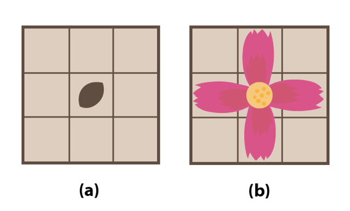
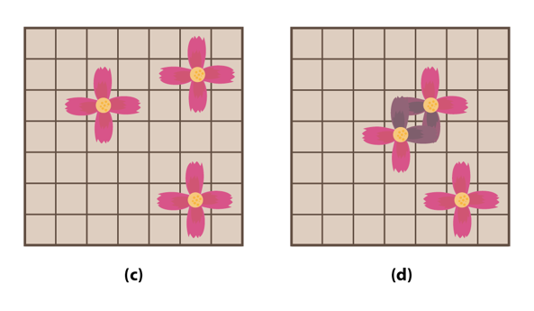

# [14620번: 꽃길](https://www.acmicpc.net/problem/14620)

2017년 4월 5일 식목일을 맞이한 진아는 나무를 심는 대신 하이테크관 앞 화단에 꽃을 심어 등교할 때 마다 꽃길을 걷고 싶었다.

진아가 가진 꽃의 씨앗은 꽃을 심고나면 정확히 1년후에 꽃이 피므로 진아는 다음해 식목일 부터 꽃길을 걸을 수 있다.

하지만 진아에게는 꽃의 씨앗이 세개밖에 없었으므로 세 개의 꽃이 하나도 죽지 않고 1년후에 꽃잎이 만개하길 원한다.

꽃밭은 N*N의 격자 모양이고 진아는 씨앗을 (1,1)~(N,N)의 지점 중 한곳에 심을 수 있다. 꽃의 씨앗은 그림 (a)처럼 심어지며 1년 후 꽃이 피면 그림 (b)모양이 된다.



꽃을 심을 때는 주의할 점이있다. 어떤 씨앗이 꽃이 핀 뒤 다른 꽃잎(혹은 꽃술)과 닿게 될 경우 두 꽃 모두 죽어버린다. 또 화단 밖으로 꽃잎이 나가게 된다면 그 꽃은 죽어버리고 만다.



그림(c)는 세 꽃이 정상적으로 핀 모양이고 그림(d)는 두 꽃이 죽어버린 모양이다.

하이테크 앞 화단의 대여 가격은 격자의 한 점마다 다르기 때문에 진아는 서로 다른 세 씨앗을 모두 꽃이 피게하면서 가장 싼 가격에 화단을 대여하고 싶다.

단 화단을 대여할 때는 꽃잎이 핀 모양을 기준으로 대여를 해야하므로 꽃 하나당 5평의 땅을 대여해야만 한다.

돈이 많지 않은 진아를 위하여 진아가 꽃을 심기 위해 필요한 최소비용을 구해주자!

## 입출력

### 입력

입력의 첫째 줄에 화단의 한 변의 길이 N(6≤N≤10)이 들어온다.

이후 N개의 줄에 N개씩 화단의 지점당 가격(0≤G≤200)이 주어진다.

### 출력

꽃을 심기 위한 최소 비용을 출력한다.

## 예제

### 예제 입력 1

```text
6
1 0 2 3 3 4
1 1 1 1 1 1
0 0 1 1 1 1
3 9 9 0 1 99
9 11 3 1 0 3
12 3 0 0 0 1
```

### 예제 출력 1

```text
12
```

## 알고리즘 분류

- 브루트포스 알고리즘
- 백트래킹

## 시도

### 시도1(32412kb, 896ms)

겹치지 않는 꽃밭 3개를 만들고, 가장 적은 비용으로 만든 꽃밭의 비용을 출력하는 문제이다.

3개의 겹치지 않는 꽃밭을 만들기 위해 `visited`라는 방문 저장소를 이용해서 겹치지 않는 꽃밭을 만들 수 있는지 판단하고,
겹쳐지지 않는 꽃밭을 만들 수 있을 때, 추가로 방문한다.

방문 후 `size`를 모두 소진(size == 0)하면, `calculate_cost()`를 이용하여 방문한 꽃밭들의 비용을 계산한 후 최솟값을 비교한다.

```python
# https://www.acmicpc.net/problem/14620
# 꽃길
import sys

input = sys.stdin.readline

DIRECTIONS = [(0, 0), (0, 1), (1, 0), (0, -1), (-1, 0)]

N = int(input())
graphs = [list(map(int, input().split())) for _ in range(N)]


# N = 6
# graphs = [
#     [1, 0, 2, 3, 3, 4],
#     [1, 1, 1, 1, 1, 1],
#     [0, 0, 1, 1, 1, 1],
#     [3, 9, 9, 0, 1, 99],
#     [9, 11, 3, 1, 0, 3],
#     [12, 3, 0, 0, 0, 1]
# ]


def calculate_cost(graph, visited):
    global answer

    result = 0
    for i in range(N):
        for j in range(N):
            if visited[i][j]:
                result += graph[i][j]
    answer = min(answer, result)


def is_possible(row, col, visited):
    for dx, dy in DIRECTIONS:
        r, c = row + dx, col + dy
        if not (0 <= r < N and 0 <= c < N and not visited[r][c]):
            return False
    return True


def back_tracking(graph, visited, size=3):
    if size == 0:
        calculate_cost(graph, visited)
        return

    for row in range(N):
        for col in range(N):
            if not visited[row][col]:
                if is_possible(row, col, visited):
                    for dx, dy in DIRECTIONS:
                        visited[row + dx][col + dy] = True
                    back_tracking(graph, visited, size - 1)
                    for dx, dy in DIRECTIONS:
                        visited[row + dx][col + dy] = False


v = [[False] * N for _ in range(N)]
answer = int(1e10)
back_tracking(graphs, v)
print(answer)
```