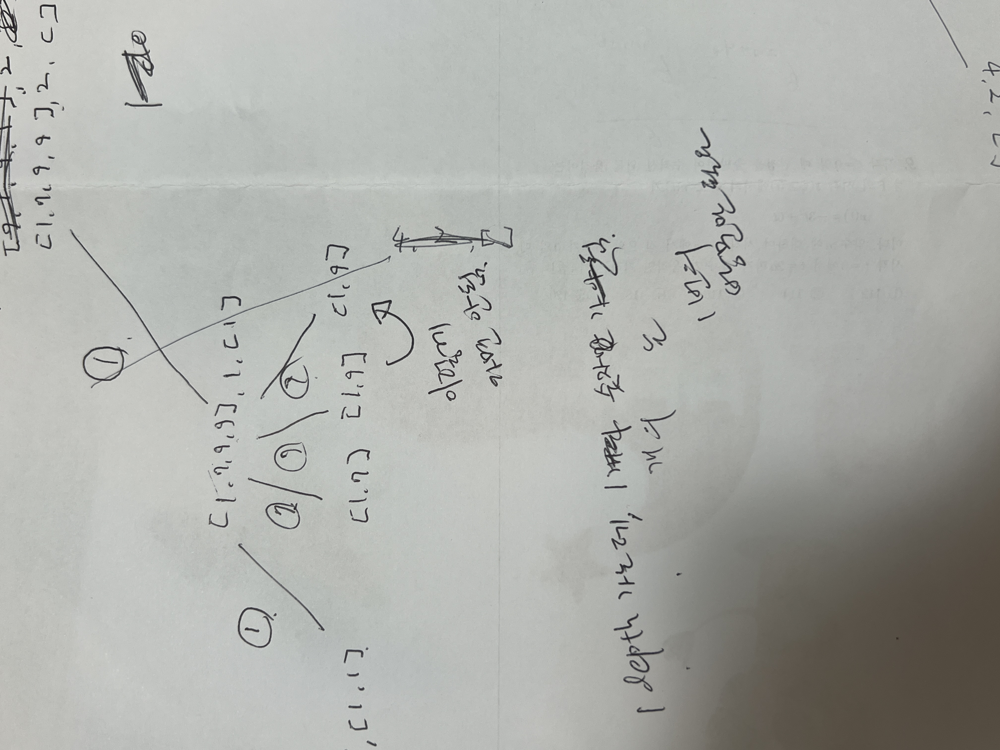

# 15664번: N과 M (11)

N개의 자연수와 자연수 M이 주어졌을 때, 아래 조건을 만족하는 길이가 M인 수열을 모두 구하는 프로그램을 작성하시오.

- N개의 자연수 중에서 M개를 고른 수열
- 같은 수를 여러 번 골라도 된다.

## 입출력

### 입력

첫째 줄에 N과 M이 주어진다. (1 ≤ M ≤ N ≤ 7)

둘째 줄에 N개의 수가 주어진다. 입력으로 주어지는 수는 10,000보다 작거나 같은 자연수이다.

### 출력

한 줄에 하나씩 문제의 조건을 만족하는 수열을 출력한다. 중복되는 수열을 여러 번 출력하면 안되며, 각 수열은 공백으로 구분해서 출력해야 한다.

수열은 사전 순으로 증가하는 순서로 출력해야 한다.

## 예제

### 예제 입력 1

```text
3 1
4 4 2
```

### 예제 출력 1

```text
2
4
```

### 예제 입력 2

```text
4 2
9 7 9 1
```

### 예제 출력 2

```text
1 1
1 7
1 9
7 1
7 7
7 9
9 1
9 7
9 9
```

### 예제 입력 3

```text
4 4
1 1 2 2
```

### 예제 출력 3

```text
1 1 1 1
1 1 1 2
1 1 2 1
1 1 2 2
1 2 1 1
1 2 1 2
1 2 2 1
1 2 2 2
2 1 1 1
2 1 1 2
2 1 2 1
2 1 2 2
2 2 1 1
2 2 1 2
2 2 2 1
2 2 2 2
```

## 알고리즘 분류

- 백트래킹

## 시도

### 시도1(시간 초과)

[15664번](./baekjoon_15664.md) 문제처럼 `answer`을 이용하여 검색하는 방식으로 문제를 해결하려고 했지만,
시간 초과 발생

```python
# https://www.acmicpc.net/problem/15665
# N과 M (11)
import sys
import itertools

input = sys.stdin.readline


N, M = map(int, input().split())
number = sorted(list(map(int, input().split())))
# N, M = 3, 1
# number = sorted(list(map(int, "4 4 2".split())))
# N, M = 4, 2
# number = sorted(list(map(int, "9 7 9 1".split())))
# N, M = 4, 4
# number = sorted(list(map(int, "1 1 2 2".split())))
answer = []

for permutation in itertools.product(number, repeat=M):
    if permutation not in answer:
        answer.append(permutation)
        print(*permutation, sep=' ')
```

### 시도2(32412kb, 728ms)

어떻게 해야할지 고민해보다가, 손으로 수열을 만드는 알고리즘을 그려보았다.



그리면서 느낀 건, 한 번의 재귀 스택 안에서 `1 9`가 다시 출력되려고 할 때,
동일한 숫자를 막아주는 것이었다.

이를 코드로 구현한 것이다.

```python
# https://www.acmicpc.net/problem/15665
# N과 M (11)
import sys
import itertools

input = sys.stdin.readline


def permutations(arr, size, visited, repository=[]):
    if size == 0:
        print(*repository, sep=' ')
        return

    for index, current in enumerate(arr):
        if current not in visited:
            visited.append(current)
            repository.append(current)
            permutations(arr, size - 1, [])
            repository.pop()


N, M = map(int, input().split())
number = sorted(list(map(int, input().split())))
# N, M = 3, 1
# number = sorted(list(map(int, "4 4 2".split())))
# N, M = 4, 2
# number = sorted(list(map(int, "9 7 9 1".split())))
# N, M = 4, 4
# number = sorted(list(map(int, "1 1 2 2".split())))

permutations(number, M, [])
```

### 시도3(33432kb, 716ms)

[랑뎁](https://ysl-iras.tistory.com/entry/파이썬Python-백준-15665번-N과-M-11)님의 블로그를 보고 작성한 코드이다.

랑뎁님은 리스트로 값을 저장한 게 아닌, 어차피 비내림차순으로 정렬이 되어 있으니 한 재귀 스택에서 이전의 숫자만 기억하여
문제를 해결하였다.

```python
# https://www.acmicpc.net/problem/15665
# N과 M (11)
import sys

input = sys.stdin.readline


def permutations(arr, size, repository=[]):
    if size == 0:
        print(*repository, sep=' ')
        return

    pre = -1
    for index, current in enumerate(arr):
        if current != pre:
            pre = current
            repository.append(current)
            permutations(arr, size - 1)
            repository.pop()


N, M = map(int, input().split())
number = sorted(list(map(int, input().split())))
# N, M = 3, 1
# number = sorted(list(map(int, "4 4 2".split())))
# N, M = 4, 2
# number = sorted(list(map(int, "9 7 9 1".split())))
# N, M = 4, 4
# number = sorted(list(map(int, "1 1 2 2".split())))

permutations(number, M)
```

### 시도4(33432kb, 660ms)

[파이리썬](https://claude-u.tistory.com/310)님의 블로그를 보고 작성한 코드

처음에 나도 `itertools.product()`를 사용하려고 했으나, set으로 중복 제거를 했을 때,
어떻게 숫자를 중복되게 출력할 수 있는지를 모르겠어서 사용하지 못 했었다.

**파이리썬**님의 코드를 보고 배운 코드

```python
# https://www.acmicpc.net/problem/15665
# N과 M (11)
import sys
import itertools

input = sys.stdin.readline

N, M = map(int, input().split())
number = list(map(int, input().split()))
# N, M = 3, 1
# number = list(map(int, "4 4 2".split()))
# N, M = 4, 2
# number = list(map(int, "9 7 9 1".split()))
# N, M = 4, 4
# number = list(map(int, "1 1 2 2".split()))

for permutation in itertools.product(set(number), repeat=M):
    print(*permutation, sep=' ')
```

### 시도5(32412kb, 676ms)

[Alan_kim](https://thought-process-ing.tistory.com/90)님의 블로그를 보고 수정한 코드

나는 M에 관계 없이 N이 M보다 커야 수열을 만들 수 있는 줄 알았다. 하지만, 중복을 제거한 후 N이 M보다 작아져도
N의 크기에 관계없이 계속해서 M만큼 재귀를 돌기 때문에, N의 크기는 크게 상관이 없다.

따라서 `set`을 이용하여 해결할 수 있음

내 코드를 정확히 이해하지 못 해서 발생한 문제같다.

```python
# https://www.acmicpc.net/problem/15665
# N과 M (11)
import sys

input = sys.stdin.readline


def permutations(arr, size, repository=[]):
    if size == 0:
        print(*repository, sep=' ')
        return

    pre = -1
    for index, current in enumerate(arr):
        if current != pre:
            pre = current
            repository.append(current)
            permutations(arr, size - 1)
            repository.pop()


N, M = map(int, input().split())
number = sorted(list(map(int, input().split())))
# N, M = 3, 1
# number = sorted(list(map(int, "4 4 2".split())))
# N, M = 4, 2
# number = sorted(list(map(int, "9 7 9 1".split())))
# N, M = 4, 4
# number = sorted(set(map(int, "1 1 2 2".split())))

permutations(number, M)
```

+**Alan_kim**님의 코드를 보고 set으로만 변경 후 구현해본 정답(32412kb, 688ms)

```python
# https://www.acmicpc.net/problem/15665
# N과 M (11)
import sys

input = sys.stdin.readline


def permutations(arr, size, repository=[]):
    if size == 0:
        print(*repository, sep=' ')
        return

    for index, current in enumerate(arr):
        repository.append(current)
        permutations(arr, size - 1)
        repository.pop()


N, M = map(int, input().split())
number = sorted(list(map(int, input().split())))

permutations(number, M)
```
