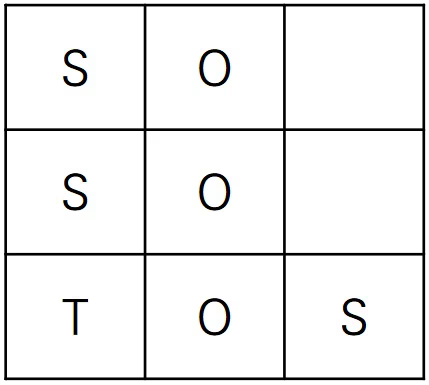
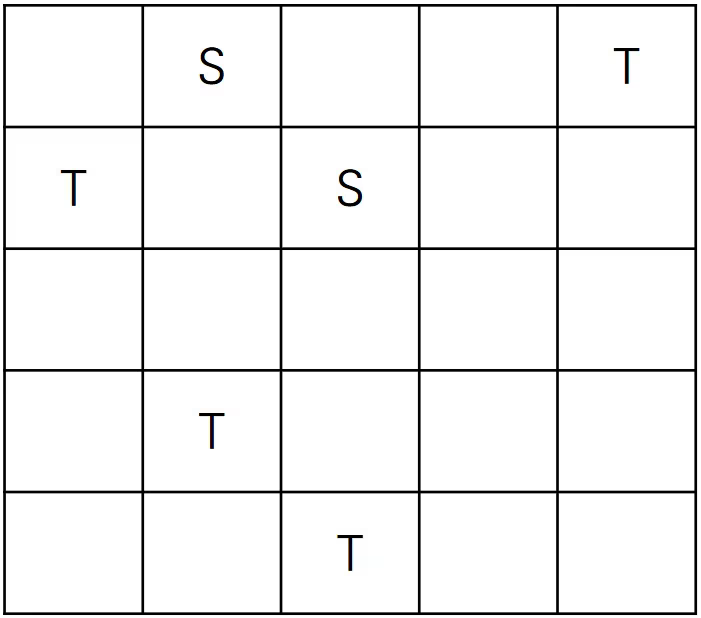
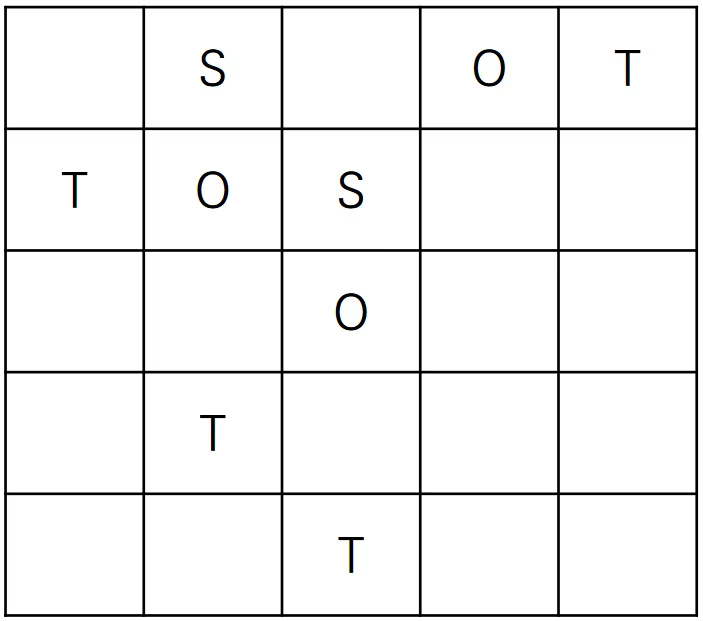

# [18428번: 감시 피하기](https://www.acmicpc.net/problem/18428)

NxN 크기의 복도가 있다. 복도는 1x1 크기의 칸으로 나누어지며, 특정한 위치에는 선생님, 학생, 혹은 장애물이 위치할 수 있다. 현재 몇 명의 학생들은 수업시간에 몰래 복도로 빠져나왔는데, 복도로 빠져나온
학생들은 선생님의 감시에 들키지 않는 것이 목표이다.

각 선생님들은 자신의 위치에서 상, 하, 좌, 우 4가지 방향으로 감시를 진행한다. 단, 복도에 장애물이 위치한 경우, 선생님은 장애물 뒤편에 숨어 있는 학생들은 볼 수 없다. 또한 선생님은 상, 하, 좌, 우
4가지 방향에 대하여, 아무리 멀리 있더라도 장애물로 막히기 전까지의 학생들은 모두 볼 수 있다고 가정하자.

다음과 같이 3x3 크기의 복도의 정보가 주어진 상황을 확인해보자. 본 문제에서 위치 값을 나타낼 때는 (행,열)의 형태로 표현한다. 선생님이 존재하는 칸은 T, 학생이 존재하는 칸은 S, 장애물이 존재하는 칸은
O로 표시하였다. 아래 그림과 같이 (3,1)의 위치에는 선생님이 존재하며 (1,1), (2,1), (3,3)의 위치에는 학생이 존재한다. 그리고 (1,2), (2,2), (3,2)의 위치에는 장애물이 존재한다.



이 때 (3,3)의 위치에 존재하는 학생은 장애물 뒤편에 숨어 있기 때문에 감시를 피할 수 있다. 하지만 (1,1)과 (2,1)의 위치에 존재하는 학생은 선생님에게 들키게 된다.

학생들은 복도의 빈 칸 중에서 장애물을 설치할 위치를 골라, 정확히 3개의 장애물을 설치해야 한다. 결과적으로 3개의 장애물을 설치하여 모든 학생들을 감시로부터 피하도록 할 수 있는지 계산하고자 한다. NxN 크기의
복도에서 학생 및 선생님의 위치 정보가 주어졌을 때, 장애물을 정확히 3개 설치하여 모든 학생들이 선생님들의 감시를 피하도록 할 수 있는지 출력하는 프로그램을 작성하시오.

예를 들어 N=5일 때, 다음과 같이 선생님 및 학생의 위치 정보가 주어졌다고 가정하자.



이 때 다음과 같이 3개의 장애물을 설치하면, 모든 학생들을 선생님의 감시로부터 피하도록 만들 수 있다.


## 입출력

### 입력

첫째 줄에 자연수 N이 주어진다. (3 ≤ N ≤ 6) 둘째 줄에 N개의 줄에 걸쳐서 복도의 정보가 주어진다. 각 행에서는 N개의 원소가 공백을 기준으로 구분되어 주어진다. 해당 위치에 학생이 있다면 S, 선생님이
있다면 T, 아무것도 존재하지 않는다면 X가 주어진다.

단, 전체 선생님의 수는 5이하의 자연수, 전체 학생의 수는 30이하의 자연수이며 항상 빈 칸의 개수는 3개 이상으로 주어진다.

### 출력

첫째 줄에 정확히 3개의 장애물을 설치하여 모든 학생들을 감시로부터 피하도록 할 수 있는지의 여부를 출력한다. 모든 학생들을 감시로부터 피하도록 할 수 있다면 "YES", 그렇지 않다면 "NO"를 출력한다.

## 예제

### 예제 입력 1

```text
5
X S X X T
T X S X X
X X X X X
X T X X X
X X T X X
```

### 예제 출력 1

```text
YES
```

### 예제 입력 2

```text
4
S S S T
X X X X
X X X X
T T T X
```

### 예제 출력 2

```text
NO
```

## 알고리즘 분류

- 브루트포스 알고리즘
- 백트래킹

## 시도

### 시도1(32412kb, 84ms)

방해물을 3개 설치하여, 선생님의 감시로부터 학생들이 안 들킬 수 있는지 판별하는 문제이다.

백트래킹을 이용하여 장애물을 3개 설치하고, 3개 설치한 후에는 감시를 피할 수 있는지 확인한다.

```python
# https://www.acmicpc.net/problem/18428
# 감시 피하기
import sys

input = sys.stdin.readline

DIRECTIONS = [(0, 1), (1, 0), (0, -1), (-1, 0)]

N = int(input())
graphs = []  # 전체 그래프
teachers = []  # 선생님 위치

for row in range(N):
    graphs.append(list(input().split()))
    for col in range(N):
        if graphs[row][col] == "T":
            teachers.append((row, col))


def is_possible(graph, current):  # 감시를 피할 수 있는가 ?
    for dx, dy in DIRECTIONS:  # 4가지 방향에 대해
        x, y = current

        while 0 <= x < N and 0 <= y < N:
            if graph[x][y] == "O":  # 만약 학생을 만나기 전에 장애물이 있다면 멈춤
                break

            if graph[x][y] == "S":  # 장애물을 만나기 전에 학생을 먼저 만나면 False
                return False

            x, y = x + dx, y + dy  # 이동 위치를 update 한다.
    return True


def back_tracking(graph, teacher_list, size):
    if size == 0:  # 장애물이 모두 설치됐을 때
        for teacher in teacher_list:  # 선생님의 위치를 탐색하여 학생을 만나는지 확인
            if not is_possible(graph, teacher):  # 만약 학생을 만나면
                return  # pass
        print("YES")  # 학생을 만나지 않고, 반복문이 끝나면 YES 후 프로그램이 종료된다.
        exit()

    for i in range(N):
        for j in range(N):
            if graph[i][j] == "X":  # 장애물을 설치할 수 있는 공간이면
                graph[i][j] = "O"  # 장애물 설치 후
                back_tracking(graph, teacher_list, size - 1)  # 재귀
                graph[i][j] = "X"  # 장애물을 다시 제거하여, 새로운 장애물을 만들 수 있도록 한다.


back_tracking(graphs, teachers, 3)
print("NO")  # YES가 출력되지 않았다면, NO가 출력된다.
```