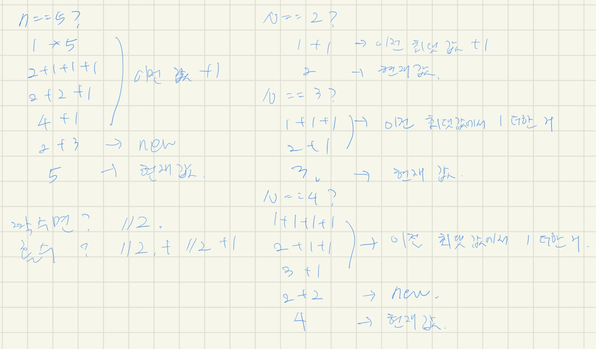

# [11052번: 카드 구매하기]()

desc

## 입출력

### 입력


### 출력


## 예제

### 예제 입력 1

```text

```

### 예제 출력 1

```text

```

### 예제 입력 2

```text

```

### 예제 출력 2

```text

```

### 예제 입력 3

```text

```

### 예제 출력 3

```text

```

## 힌트


## 알고리즘 분류


## 시도

### 시도1(시간 초과)

DP 문제인 걸 확인하였지만, 백트래킹 방식이 더 쉬울 것 같아서 조합을 이용하여 4가 되는 조합을 구했고,
조합의 값들을 이용해 최댓값을 구해 답을 제출해보았으나, 시간 초과가 발생했다.

```python
# https://www.acmicpc.net/problem/11052
# 카드 구매하기
import sys
from itertools import combinations_with_replacement

input = sys.stdin.readline

N = int(input())
prices = list(map(int, input().rstrip().split()))

answer = 0
for repeat in range(1, N + 1):
    for combination in combinations_with_replacement([num for num in range(1, N + 1)], r=repeat):
        if sum(combination) == N:
            result = 0
            for index in combination:
                result += prices[index - 1]

            answer = max(answer, result)

print(answer)
```

### 시도2(오답)

아래 코드와 같이 풀었더니 오답이 나왔다.

[애기 개발자](https://baby-dev.tistory.com/entry/Python-백준-11052번-카드-구매하기-실버1)님의 블로그에서 아래 반례를 찾았고,

```text
12
1 1 6 8 11 1 1 1 1 1 1 1
```

정답은 `25`가 나와야 하지만, 내 코드에서는 `24`가 나왔다.



(문제를 풀며 빠르게 작성해서)나만 알아볼 수 있는 글씨와 식이지만, 나는 이렇게 하나씩 최댓값을 구하고 짝수와 홀수를 구분하여 최댓값을 구하면 되는 줄 알았지만,
6, 8, 11을 고르는 3, 4, 5를 고를 방법이 내 코드에는 존재하지 않았다.

결국 지피티의 도움으로 코드를 수정했다,,!

```python
# https://www.acmicpc.net/problem/11052
# 카드 구매하기
import sys

input = sys.stdin.readline

N = int(input())
prices = list(map(int, input().rstrip().split()))
# N = 4
# prices = [1, 5, 6, 7]
# N = 5
# prices = [10, 9, 8, 7, 6]
# N = 10
# prices = [1, 1, 2, 3, 5, 8, 13, 21, 34, 55]
repository = [0] + prices.copy()

if N == 1:
    print(repository[1])
    exit()

repository[2] = max(repository[1] * 2, repository[2])
if N == 2:
    print(repository[2])
else:
    repository[3] = max(repository[2] + repository[1], repository[3])

    for current in range(4, N + 1):
        if current % 2 == 0:
            repository[current] = max(repository[current],
                                      repository[current - 1] + repository[1], repository[current // 2] * 2)
        else:
            repository[current] = max(repository[current], repository[current - 1] + repository[1],
                                      repository[current // 2] + repository[current // 2 + 1])

print(repository[N])

```

### 시도3(32544kb, 172ms)

지피티에게 물어보고, 받은 코드

```python
# https://www.acmicpc.net/problem/11052
# 카드 구매하기
import sys

input = sys.stdin.readline

N = int(input())
prices = list(map(int, input().rstrip().split()))
# N = 4
# prices = [1, 5, 6, 7]
# N = 5
# prices = [10, 9, 8, 7, 6]
# N = 10
# prices = [1, 1, 2, 3, 5, 8, 13, 21, 34, 55]
repository = [0] + prices.copy()

for current in range(1, N + 1):  # 현재 구하는 카드의 수
    for increment_index in range(1, current + 1):  # 1 ~ current 까지
        # 현재 prices의 인덱스 값을 1씩 증가시키고, repository(dp)의 인덱스 값을 1씩 감소시켜서
        # 최적화된 답을 도출해낸다.
        # 결국, 연속된 인덱스에서도 최댓값을 찾을 수 있음
        repository[current] = max(repository[current],
                                  repository[current - increment_index] + prices[increment_index - 1])

print(repository[N])
```

## 정리
