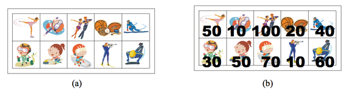

# [9465번: 스티커](https://www.acmicpc.net/problem/9465)

상근이의 여동생 상냥이는 문방구에서 스티커 2n개를 구매했다. 스티커는 그림 (a)와 같이 2행 n열로 배치되어 있다. 상냥이는 스티커를 이용해 책상을 꾸미려고 한다.

상냥이가 구매한 스티커의 품질은 매우 좋지 않다. 스티커 한 장을 떼면, 그 스티커와 변을 공유하는 스티커는 모두 찢어져서 사용할 수 없게 된다. 즉, 뗀 스티커의 왼쪽, 오른쪽, 위, 아래에 있는 스티커는 사용할
수 없게 된다.



모든 스티커를 붙일 수 없게된 상냥이는 각 스티커에 점수를 매기고, 점수의 합이 최대가 되게 스티커를 떼어내려고 한다. 먼저, 그림 (b)와 같이 각 스티커에 점수를 매겼다. 상냥이가 뗄 수 있는 스티커의 점수의
최댓값을 구하는 프로그램을 작성하시오. 즉, 2n개의 스티커 중에서 점수의 합이 최대가 되면서 서로 변을 공유 하지 않는 스티커 집합을 구해야 한다.

위의 그림의 경우에 점수가 50, 50, 100, 60인 스티커를 고르면, 점수는 260이 되고 이 것이 최대 점수이다. 가장 높은 점수를 가지는 두 스티커 (100과 70)은 변을 공유하기 때문에, 동시에 뗄 수
없다.

## 입출력

### 입력

첫째 줄에 테스트 케이스의 개수 T가 주어진다. 각 테스트 케이스의 첫째 줄에는 n (1 ≤ n ≤ 100,000)이 주어진다. 다음 두 줄에는 n개의 정수가 주어지며, 각 정수는 그 위치에 해당하는 스티커의
점수이다. 연속하는 두 정수 사이에는 빈 칸이 하나 있다. 점수는 0보다 크거나 같고, 100보다 작거나 같은 정수이다.

### 출력

각 테스트 케이스 마다, 2n개의 스티커 중에서 두 변을 공유하지 않는 스티커 점수의 최댓값을 출력한다.

## 예제

### 예제 입력 1

```text
2
5
50 10 100 20 40
30 50 70 10 60
7
10 30 10 50 100 20 40
20 40 30 50 60 20 80
```

### 예제 출력 1

```text
260
290
```

## 알고리즘 분류

- 다이나믹 프로그래밍

## 시도

### 시도1(49404kb, 632ms)

옛날에 돌다리를 건너는 문제를 풀었던 적이 있어서 문제를 푸는 방식은 익숙했다.

현재의 돌다리를 선택할 때 어떻게 현재 돌다리를 선택해야 할 지는 접근이 가능했지만,
디피 코드가 익숙하지 않아서 30분 넘게 고민하다가 블로그를 검색해서 문제를 해결했다.

[상식 너머](https://beyond-common-sense.tistory.com/10)님의 블로그를 보고 작성한 코드이다.

```python
# https://www.acmicpc.net/problem/9465
# 스티커
import sys

input = sys.stdin.readline

T = int(input())

for _ in range(T):
    n = int(input())
    number = [list(map(int, input().split())) for _ in range(2)]

    repository = [[0] * n for _ in range(2)]

    repository[0][0], repository[1][0] = number[0][0], number[1][0]
    if n == 1:  # 1개일 때는, 현재까지 저장된 최댓값을 출력해주면 된다.
        print(max(repository[0][0], repository[1][0]))
        continue

    repository[0][1], repository[1][1] = (number[1][0] + number[0][1],
                                          number[0][0] + number[1][1])
    if n == 2:  # 2개일 때는, 최대한 많이 고르는 것이 좋기 때문에, 대각선으로 선택한 것이 최대인 것을 출력한다.
        print(max(repository[0][1], repository[1][1]))
        continue

    for current in range(2, n):  # 인덱스 1번까지(0, 1) 값을 구했기 때문에 2부터 시작한다
        # 현재 최댓값을 구하는 방법은 대각선으로 2번 오는 방법과, 2개 이전의 다리에서 대각선으로 현재 다리를 선택하는 방법이다.
        # 윗 다리와 아랫 다리의 최댓값이 다르기 때문에 2개로 저장을 해준다.
        repository[0][current] = max(repository[1][current - 1], repository[1][current - 2]) + number[0][current]
        repository[1][current] = max(repository[0][current - 1], repository[0][current - 2]) + number[1][current]

    print(max(repository[0][n - 1], repository[1][n - 1]))

```

## 정리

DP는 아직 풀기 어려운 것 같다.
