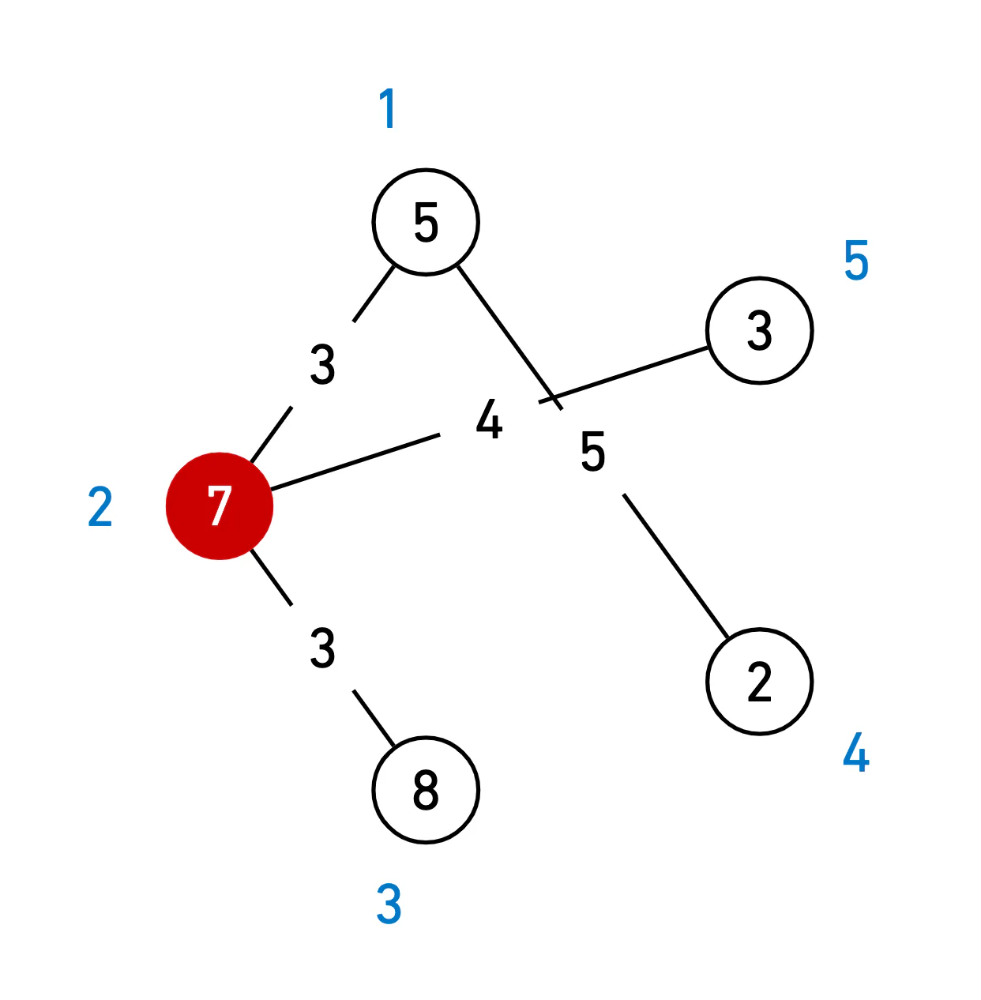

# [14938번: 서강그라운드](https://www.acmicpc.net/problem/14938)

예은이는 요즘 가장 인기가 있는 게임 서강그라운드를 즐기고 있다. 서강그라운드는 여러 지역중 하나의 지역에 낙하산을 타고 낙하하여, 그 지역에 떨어져 있는 아이템들을 이용해 서바이벌을 하는 게임이다. 서강그라운드에서
1등을 하면 보상으로 치킨을 주는데, 예은이는 단 한번도 치킨을 먹을 수가 없었다. 자신이 치킨을 못 먹는 이유는 실력 때문이 아니라 아이템 운이 없어서라고 생각한 예은이는 낙하산에서 떨어질 때 각 지역에 아이템
들이 몇 개 있는지 알려주는 프로그램을 개발을 하였지만 어디로 낙하해야 자신의 수색 범위 내에서 가장 많은 아이템을 얻을 수 있는지 알 수 없었다.

각 지역은 일정한 길이 l (1 ≤ l ≤ 15)의 길로 다른 지역과 연결되어 있고 이 길은 양방향 통행이 가능하다. 예은이는 낙하한 지역을 중심으로 거리가 수색 범위 m (1 ≤ m ≤ 15) 이내의 모든 지역의
아이템을 습득 가능하다고 할 때, 예은이가 얻을 수 있는 아이템의 최대 개수를 알려주자.



주어진 필드가 위의 그림과 같고, 예은이의 수색범위가 4라고 하자. ( 원 밖의 숫자는 지역 번호, 안의 숫자는 아이템 수, 선 위의 숫자는 거리를 의미한다) 예은이가 2번 지역에 떨어지게 되면 1번,2번(자기
지역), 3번, 5번 지역에 도달할 수 있다. (4번 지역의 경우 가는 거리가 3 + 5 = 8 > 4(수색범위) 이므로 4번 지역의 아이템을 얻을 수 없다.) 이렇게 되면 예은이는 23개의 아이템을 얻을 수 있고,
이는 위의 필드에서 예은이가 얻을 수 있는 아이템의 최대 개수이다.

## 입출력

### 입력

첫째 줄에는 지역의 개수 n (1 ≤ n ≤ 100)과 예은이의 수색범위 m (1 ≤ m ≤ 15), 길의 개수 r (1 ≤ r ≤ 100)이 주어진다.

둘째 줄에는 n개의 숫자가 차례대로 각 구역에 있는 아이템의 수 t (1 ≤ t ≤ 30)를 알려준다.

세 번째 줄부터 r+2번째 줄 까지 길 양 끝에 존재하는 지역의 번호 a, b, 그리고 길의 길이 l (1 ≤ l ≤ 15)가 주어진다.

지역의 번호는 1이상 n이하의 정수이다. 두 지역의 번호가 같은 경우는 없다.

### 출력

예은이가 얻을 수 있는 최대 아이템 개수를 출력한다.

## 예제

### 예제 입력 1

```text
5 5 4
5 7 8 2 3
1 4 5
5 2 4
3 2 3
1 2 3
```

### 예제 출력 1

```text
23
```

## 알고리즘 분류

- 그래프 이론
- 최단 경로
- 데이크스트라
- 플로이드-워셜

## 시도

### 시도1

1 ~ N 까지의 지역 중 어느 지역에 내려야 수색 범위(M)이내에서 가장 많은 아이템을 얻을 수 있는지를 구하는 문제이다.

다익스트라 알고리즘을 이용해서 각 노드들에 대해 이동할 수 있는 최소 거리들을 구하고,
아이템 갯수를 계산하여 가장 많은 아이템을 가진 수를 출력한다.

```python
# https://www.acmicpc.net/problem/14938
# 서강그라운드
import heapq
import sys

input = sys.stdin.readline
INF = int(1e10)

N, M, R = map(int, input().split())
items = list(map(int, input().split()))

graphs = [[] for _ in range(N + 1)]
for _ in range(R):
    _from, _to, weight = map(int, input().split())
    graphs[_from].append((_to, weight))
    graphs[_to].append((_from, weight))


def dijkstra(graph, start):
    distances = [INF] * (N + 1)
    distances[start] = 0
    q = []
    heapq.heappush(q, (0, start))

    while q:
        current_weight, now = heapq.heappop(q)

        if distances[now] < current_weight:
            continue

        for next_node, next_weight in graph[now]:
            cost = current_weight + next_weight

            if distances[next_node] > cost:
                distances[next_node] = cost
                heapq.heappush(q, (cost, next_node))

    return distances


answer = 0
for current in range(1, N + 1):
    result = dijkstra(graphs, current)  # 각 지역(current)에 대해 최단 거리 구하기

    total = 0  # 현재 지역에 대한 총 아이템 획득 수
    for index in range(1, N + 1):
        if result[index] <= M:  # 현재의 거리가 수색 범위 안에 있다면
            total += items[index - 1]  # 값 업데이트

    answer = max(total, answer)  # 현재까지 저장 된 가장 많은 수를 저장함

print(answer)
```

### 시도2(35508kb, 328ms)

알고리즘 분류에 플로이드 워샬도 있어서 다시 생각을 해보니, 모든 그래프 경로에 대해 최솟값을 구하는 것이기 때문에,
플로이드 워샬로도 문제를 해결할 수 있을 것 같아 해당 알고리즘으로 문제를 해결해봤다.

아무래도, 다익스트라 알고리즘은 `heapq`를 이용해서 문제를 해결할 수 있기 때문에, 문제 해결 시간이 더 빠른 것 같다.

```python
# https://www.acmicpc.net/problem/14938
# 서강그라운드
import sys

input = sys.stdin.readline
INF = int(1e10)

N, M, R = map(int, input().split())
items = list(map(int, input().split()))

graphs = [[INF] * (N + 1) for _ in range(N + 1)]
for _ in range(R):
    _from, _to, weight = map(int, input().split())
    graphs[_from][_to] = weight
    graphs[_to][_from] = weight

for current in range(N + 1):
    graphs[current][current] = 0

for k in range(1, N + 1):  # k를 경유
    for i in range(1, N + 1):  # i에서
        for j in range(1, N + 1):  # j까지
            graphs[i][j] = min(graphs[i][j], graphs[i][k] + graphs[k][j])

answer = 0
for distances in graphs[1:]:
    total = 0
    for index in range(1, len(distances)):
        if distances[index] <= M:
            total += items[index - 1]
    answer = max(answer, total)
print(answer)
```