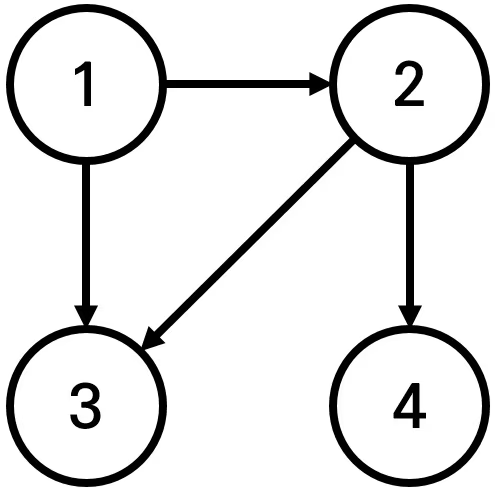

# [18352번: 특정 거리의 도시 찾기](https://www.acmicpc.net/problem/18352)

어떤 나라에는 1번부터 N번까지의 도시와 M개의 단방향 도로가 존재한다. 모든 도로의 거리는 1이다.

이 때 특정한 도시 X로부터 출발하여 도달할 수 있는 모든 도시 중에서, 최단 거리가 정확히 K인 모든 도시들의 번호를 출력하는 프로그램을 작성하시오. 또한 출발 도시 X에서 출발 도시 X로 가는 최단 거리는 항상 0이라고 가정한다.

예를 들어 N=4, K=2, X=1일 때 다음과 같이 그래프가 구성되어 있다고 가정하자.



이 때 1번 도시에서 출발하여 도달할 수 있는 도시 중에서, 최단 거리가 2인 도시는 4번 도시 뿐이다.  2번과 3번 도시의 경우, 최단 거리가 1이기 때문에 출력하지 않는다.

## 입출력

### 입력
첫째 줄에 도시의 개수 N, 도로의 개수 M, 거리 정보 K, 출발 도시의 번호 X가 주어진다. (2 ≤ N ≤ 300,000, 1 ≤ M ≤ 1,000,000, 1 ≤ K ≤ 300,000, 1 ≤ X ≤ N) 둘째 줄부터 M개의 줄에 걸쳐서 두 개의 자연수 A, B가 공백을 기준으로 구분되어 주어진다. 이는 A번 도시에서 B번 도시로 이동하는 단방향 도로가 존재한다는 의미다. (1 ≤ A, B ≤ N) 단, A와 B는 서로 다른 자연수이다.
### 출력
X로부터 출발하여 도달할 수 있는 도시 중에서, 최단 거리가 K인 모든 도시의 번호를 한 줄에 하나씩 오름차순으로 출력한다.

이 때 도달할 수 있는 도시 중에서, 최단 거리가 K인 도시가 하나도 존재하지 않으면 -1을 출력한다.


## 예제

### 예제 입력 1

```text
4 4 2 1
1 2
1 3
2 3
2 4
```

### 예제 출력 1

```text
4
```

### 예제 입력 2

```text
4 3 2 1
1 2
1 3
1 4
```

### 예제 출력 2

```text
-1
```

### 예제 입력 3

```text
4 4 1 1
1 2
1 3
2 3
2 4
```

### 예제 출력 3

```text
2
3
```

## 알고리즘 분류

- 그래프 이론
- 그래프 탐색
- 너비 우선 탐색
- 최단 경로
- 데이크스트라

## 시도

### 시도1

처음에는 플로이드 와샬(다익스트라랑 헷갈림,,,) 알고리즘을 이용하여 문제를 해결하려고 했으나,
[반례 사이트](https://testcase.ac/problems/18352)에서 메모리 에러를 접했다.

오답

```python
# https://www.acmicpc.net/problem/18352
# 특정 거리의 도시 찾기
import sys

input = sys.stdin.readline
INF = float("inf")

N, M, K, X = map(int, input().split())
# graphs = [list(map(int, input().split())) for _ in range(M)]
# N, M, K, start = 4, 4, 2, 1
# graphs = [[1, 2], [1, 3], [2, 3], [2, 4]]
graphs = [[INF] * (N + 1) for _ in range(N + 1)]

for i in range(1, N + 1):
    graphs[i][i] = 0

for i in range(M):
    city1, city2 = map(int, input().split())
    graphs[city1][city2], graphs[city2][city1] = 1, 1

for k in range(1, N + 1):
    for i in range(1, N + 1):
        for j in range(1, N + 1):
            graphs[i][j] = min(graphs[i][j], graphs[i][k] + graphs[k][j])

answer = []
for index in range(N + 1):
    if graphs[X][index] == K:
        answer.append(index)

if answer:
    print(*answer, sep='\n')
else:
    print(-1)
```

### 시도2(103180kb, 1800ms)

어떻게 그래프의 거리들을 업데이트 시켜나가야 할 지 감이 안 잡혀서 인터넷에 검색 후 [steadily-worked](https://steadily-worked.tistory.com/646)님의 블로그를 참고하였다.

시작하는 그래프로부터 `bfs` 알고리즘을 이용하여 탐색을 시작하고, 아직 방문하지 않은 그래프에 대해 값들을 업데이트시켜주었다.

```python
# https://www.acmicpc.net/problem/18352
# 특정 거리의 도시 찾기
import sys
from collections import deque

input = sys.stdin.readline

N, M, K, X = map(int, input().split())
graphs = [[] for _ in range(N + 1)]
distance = [0] * (N + 1)
visited = [False] * (N + 1)

for i in range(M):
    _from, _to = map(int, input().split())
    graphs[_from].append(_to)

need_visited = deque([X])
visited[X] = True
answer = []
while need_visited:
    now = need_visited.popleft()

    for city in graphs[now]:  # 현재 그래프가 가진 방문할 수 있는 노드들 중
        if not visited[city]:  # 방문하지 않은 그래프가 있다면
            distance[city] = distance[now] + 1  # 현재 그래프에서 +1로 이동
            need_visited.append(city)
            visited[city] = True

            if distance[city] == K:
                answer.append(city)

if answer:
    print(*answer, sep='\n')
else:
    print(-1)
```

### 시도3(시간 초과)

책에서 배운 다익스트라 알고리즘을 적용하여 다시 시도해봤지만, 시간 초과 발생 

```python
# https://www.acmicpc.net/problem/18352
# 특정 거리의 도시 찾기
import sys

input = sys.stdin.readline
INF = int(1e9)

N, M, K, X = map(int, input().split())
graphs = [[] for _ in range(N + 1)]

for _ in range(M):
    _from, _to = map(int, input().split())
    graphs[_from].append((_to, 1))

distance = [INF] * (N + 1)
visited = [False] * (N + 1)


def get_smallest_index():
    index = -1
    min_value = INF

    for current in range(1, N + 1):  # 전체 인덱스를 반복하며
        if distance[current] < min_value and not visited[current]:  # 만약 현재 최솟값보다 작은 값이 있고, 방문하지 않은 노드라면
            min_value = distance[current]  # 최솟값 변경
            index = current  # 최솟값을 가진 인덱스 저장

    return index  # 최솟값을 가진 인덱스 반환


def dijkstra(start):
    distance[start] = 0
    visited[start] = True

    for to, weight in graphs[start]:  # 시작 노드에 대한 가중치 값 설정
        distance[to] = weight

    for i in range(N - 1):  # start를 제외한 node size
        now = get_smallest_index()
        visited[now] = True

        for to, weight in graphs[now]:  # 방문하지 않았던 최솟값을 가진 노드에 대해 방문할 수 있는 모든 노드 방문
            distance[to] = min(distance[to], distance[now] + weight)  # 지금 가진 값에 대해 다른 노드를 경유해서 값과 비교하여 더 작은 값을 대입


dijkstra(X)
answer = []

for node in range(1, N + 1):
    if distance[node] == K:
        answer.append(node)

if answer:
    print(*answer, sep='\n')
else:
    print(-1)
```

### 시도4(173372kb, 2692ms)

이것이 코딩 테스트다를 이용하여 `다익스트라` 코드를 공부 및 이해 후 해결한 코드 

```python
# https://www.acmicpc.net/problem/18352
# 특정 거리의 도시 찾기
import sys
import heapq

input = sys.stdin.readline
INF = int(1e9)

N, M, K, X = map(int, input().split())
graphs = [[] for _ in range(N + 1)]

for _ in range(M):
    _from, _to = map(int, input().split())
    graphs[_from].append((_to, 1))

distance = [INF] * (N + 1)
distance[X] = 0  # 시작 지점 거리 초기화
answer = []
need_visited = []  # 방문할 노드들 저장
heapq.heappush(need_visited, (0, X))  # q에 cost(0)과 시작 지점 X를 넣음
while need_visited:  # 다익스트라 시작
    dist, now = heapq.heappop(need_visited)  # 방문해야 할 노드 꺼냄

    if distance[now] == K:  # 조건에 만족하는 노드면 정답에 포함
        answer.append(now)

    if distance[now] < dist:  # 기존 거리보다 거쳐가는 값이 더 크면, continue(pass)
        continue

    # 기존 거리보다 거쳐가는 비용이 더 적은 경우에
    for node, value in graphs[now]:  # 지금 방문할 수 있는 노드들을 탐색(노드와 가중치를 같이 꺼냄)
        cost = dist + value  # 지금 노드와 다음에 방문할 노드를 거쳐 가는 경우의 값을 계산
        if distance[node] > cost:  # 지금 저장된 거리보다 노드를 거쳐가는 경우의 값이 더 작은 경우에
            distance[node] = cost  # 값 업데이트
            heapq.heappush(need_visited, (cost, node))  # 노드 다시 방문

if answer:
    print(*answer, sep='\n')
else:
    print(-1)
```