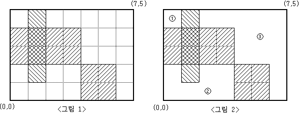

# 2583번: 영역 구하기

눈금의 간격이 1인 M×N(M,N≤100)크기의 모눈종이가 있다. 이 모눈종이 위에 눈금에 맞추어 K개의 직사각형을 그릴 때, 이들 K개의 직사각형의 내부를 제외한 나머지 부분이 몇 개의 분리된 영역으로 나누어진다.

예를 들어 M=5, N=7 인 모눈종이 위에 <그림 1>과 같이 직사각형 3개를 그렸다면, 그 나머지 영역은 <그림 2>와 같이 3개의 분리된 영역으로 나누어지게 된다.



<그림 2>와 같이 분리된 세 영역의 넓이는 각각 1, 7, 13이 된다.

M, N과 K 그리고 K개의 직사각형의 좌표가 주어질 때, K개의 직사각형 내부를 제외한 나머지 부분이 몇 개의 분리된 영역으로 나누어지는지, 그리고 분리된 각 영역의 넓이가 

## 입출력

### 입력
첫째 줄에 M과 N, 그리고 K가 빈칸을 사이에 두고 차례로 주어진다. 
M, N, K는 모두 100 이하의 자연수이다. 둘째 줄부터 K개의 줄에는 한 줄에 하나씩 직사각형의 왼쪽 아래 꼭짓점의 x, y좌표값과 오른쪽 위 꼭짓점의 x, y좌표값이 빈칸을 사이에 두고 차례로 주어진다. 
모눈종이의 왼쪽 아래 꼭짓점의 좌표는 (0,0)이고, 오른쪽 위 꼭짓점의 좌표는(N,M)이다. 
입력되는 K개의 직사각형들이 모눈종이 전체를 채우는 경우는 없다.

### 출력
첫째 줄에 분리되어 나누어지는 영역의 개수를 출력한다. 둘째 줄에는 각 영역의 넓이를 오름차순으로 정렬하여 빈칸을 사이에 두고 출력한다.
## 예제

### 예제 입력 1

```text
5 7 3
0 2 4 4
1 1 2 5
4 0 6 2
```

### 예제 출력 1

```text
3
1 7 13
```

## 시도

### 시도1

문제를 보고 DFS, BFS로 풀 수 있는 문제라고 생각하고 
더 익숙한 BFS를 이용하여 문제를 해결하였다.

DFS에 익숙해지기 위해 DFS로도 해결하였다. 

```python
# https://www.acmicpc.net/problem/2583
# 영역 구하기
import sys
from collections import deque

input = sys.stdin.readline
DIRECTIONS = [(0, 1), (1, 0), (0, -1), (-1, 0)]

M, N, K = map(int, input().split())
graphs = [[0] * N for _ in range(M)]


def bfs(graph, index):
    count = 1
    need_visited = deque([index])

    while need_visited:
        x, y = need_visited.popleft()
        for dx, dy in DIRECTIONS:
            r, c = dx + x, dy + y
            if 0 <= r < M and 0 <= c < N and graph[r][c] == 0:
                graph[r][c] = 1
                count += 1
                need_visited.append((r, c))
    return count


answer = 0
for _ in range(K):
    lh, lw, rh, rw = list(map(int, input().split()))
    rw -= 1
    rh -= 1
    for row in range(lw, rw + 1):
        for col in range(lh, rh + 1):
            graphs[row][col] = -1

length_list = []
for i in range(M):
    for j in range(N):
        if graphs[i][j] == 0:
            graphs[i][j] = 1
            answer += 1
            length_list.append(bfs(graphs, (i, j)))

print(answer)
print(*sorted(length_list), sep=" ")
```

### 시도2

```python

# https://www.acmicpc.net/problem/2583
# 영역 구하기
import sys
from collections import deque

sys.setrecursionlimit(10 ** 6)
input = sys.stdin.readline
DIRECTIONS = [(0, 1), (1, 0), (0, -1), (-1, 0)]

M, N, K = map(int, input().split())
graphs = [[0] * N for _ in range(M)]


def dfs(graph, index):
    x, y = index
    count = 1

    graph[x][y] = 1
    for dx, dy in DIRECTIONS:
        r, c = x + dx, y + dy
        if 0 <= r < M and 0 <= c < N and graph[r][c] == 0:
            count += dfs(graph, (r, c))
    return count

answer = 0
for _ in range(K):
    lh, lw, rh, rw = list(map(int, input().split()))
    rw -= 1
    rh -= 1
    for row in range(lw, rw + 1):
        for col in range(lh, rh + 1):
            graphs[row][col] = -1

length_list = []
for i in range(M):
    for j in range(N):
        if graphs[i][j] == 0:
            answer += 1
            length_list.append(dfs(graphs, (i, j)))

print(answer)
print(*sorted(length_list), sep=" ")
```

## 정리
