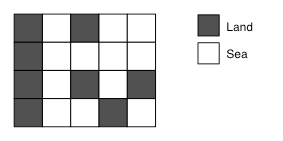

# 4963번: 섬의 개수

정사각형으로 이루어져 있는 섬과 바다 지도가 주어진다. 섬의 개수를 세는 프로그램을 작성하시오.



한 정사각형과 가로, 세로 또는 대각선으로 연결되어 있는 사각형은 걸어갈 수 있는 사각형이다. 

두 정사각형이 같은 섬에 있으려면, 한 정사각형에서 다른 정사각형으로 걸어서 갈 수 있는 경로가 있어야 한다. 지도는 바다로 둘러싸여 있으며, 지도 밖으로 나갈 수 없다.

## 입출력

### 입력
입력은 여러 개의 테스트 케이스로 이루어져 있다. 각 테스트 케이스의 첫째 줄에는 지도의 너비 w와 높이 h가 주어진다. w와 h는 50보다 작거나 같은 양의 정수이다.

둘째 줄부터 h개 줄에는 지도가 주어진다. 1은 땅, 0은 바다이다.

입력의 마지막 줄에는 0이 두 개 주어진다.
### 출력
각 테스트 케이스에 대해서, 섬의 개수를 출력한다.


## 예제

### 예제 입력 1

```text
1 1
0
2 2
0 1
1 0
3 2
1 1 1
1 1 1
5 4
1 0 1 0 0
1 0 0 0 0
1 0 1 0 1
1 0 0 1 0
5 4
1 1 1 0 1
1 0 1 0 1
1 0 1 0 1
1 0 1 1 1
5 5
1 0 1 0 1
0 0 0 0 0
1 0 1 0 1
0 0 0 0 0
1 0 1 0 1
0 0
```

### 예제 출력 1

```text
0
1
1
3
1
9
```

## 시도

### 시도1(정답)

전형적인 BFS 문제라고 판단돼 BFS 1번 시행될 때 마다, 섬 1개로 판단하여 1씩 더해줌

방문한 노드는 0으로 변경해줌

```python
# https://www.acmicpc.net/problem/4963
# 섬의 개수
import sys
from collections import deque

input = sys.stdin.readline
DIRECTIONS = [(0, 1), (1, 0), (0, -1), (-1, 0), (-1, 1), (1, 1), (1, -1), (-1, -1)]  # 대각선 포함
# PROBLEMS = [
#     list(map(int, "1 1".split())),
#     [list(map(int, "0".split()))],
#     list(map(int, "2 2".split())),
#     [list(map(int, "0 1".split())),
#     list(map(int, "1 0".split()))],
#     list(map(int, "3 2".split())),
#     [list(map(int, "1 1 1".split())),
#     list(map(int, "1 1 1".split()))],
#     list(map(int, "5 4".split())),
#     [list(map(int, "1 0 1 0 0".split())),
#     list(map(int, "1 0 0 0 0".split())),
#     list(map(int, "1 0 1 0 1".split())),
#     list(map(int, "1 0 0 1 0".split()))],
#     list(map(int, "5 4".split())),
#     [list(map(int, "1 1 1 0 1".split())),
#     list(map(int, "1 0 1 0 1".split())),
#     list(map(int, "1 0 1 0 1".split())),
#     list(map(int, "1 0 1 1 1".split()))],
#     list(map(int, "5 5".split())),
#     [list(map(int, "1 0 1 0 1".split())),
#     list(map(int, "0 0 0 0 0".split())),
#     list(map(int, "1 0 1 0 1".split())),
#     list(map(int, "0 0 0 0 0".split())),
#     list(map(int, "1 0 1 0 1".split()))],
#     list(map(int, "0 0".split()))
# ]


def bfs(graph, start):
    need_visited = deque([start])

    while need_visited:
        x, y = need_visited.popleft()
        for dx, dy in DIRECTIONS:
            row, col = x + dx, y + dy
            if (0 <= row < len(graph) and 0 <= col < len(graph[0])
                    and graph[row][col] == 1):
                graph[row][col] = 0
                need_visited.append((row, col))


while True:
    H, W = map(int, input().split())
    if W == 0 and H == 0:
        break
    graphs = [list(map(int, input().split())) for _ in range(W)]
    answer = 0
    for w in range(W):
        for h in range(H):
            if graphs[w][h] == 1:
                bfs(graphs, (w, h))
                answer += 1
    print(answer)
```

## 정리

