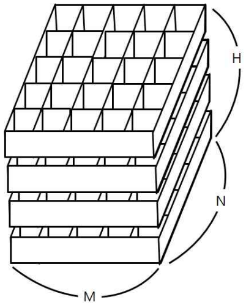

# ${number}번: title

철수의 토마토 농장에서는 토마토를 보관하는 큰 창고를 가지고 있다. 토마토는 아래의 그림과 같이 격자모양 상자의 칸에 하나씩 넣은 다음, 상자들을 수직으로 쌓아 올려서 창고에 보관한다.



창고에 보관되는 토마토들 중에는 잘 익은 것도 있지만, 아직 익지 않은 토마토들도 있을 수 있다. 보관 후 하루가 지나면, 익은 토마토들의 인접한 곳에 있는 익지 않은 토마토들은 익은 토마토의 영향을 받아 익게
된다. 하나의 토마토에 인접한 곳은 위, 아래, 왼쪽, 오른쪽, 앞, 뒤 여섯 방향에 있는 토마토를 의미한다. 대각선 방향에 있는 토마토들에게는 영향을 주지 못하며, 토마토가 혼자 저절로 익는 경우는 없다고
가정한다. 철수는 창고에 보관된 토마토들이 며칠이 지나면 다 익게 되는지 그 최소 일수를 알고 싶어 한다.

토마토를 창고에 보관하는 격자모양의 상자들의 크기와 익은 토마토들과 익지 않은 토마토들의 정보가 주어졌을 때, 며칠이 지나면 토마토들이 모두 익는지, 그 최소 일수를 구하는 프로그램을 작성하라. 단, 상자의 일부
칸에는 토마토가 들어있지 않을 수도 있다.

## 입출력

### 입력

첫 줄에는 상자의 크기를 나타내는 두 정수 M,N과 쌓아올려지는 상자의 수를 나타내는 H가 주어진다. M은 상자의 가로 칸의 수, N은 상자의 세로 칸의 수를 나타낸다. 단, 2 ≤ M ≤ 100, 2 ≤ N ≤ 100, 1 ≤ H ≤ 100 이다. 둘째 줄부터는 가장 밑의 상자부터 가장 위의 상자까지에 저장된 토마토들의 정보가 주어진다. 즉, 둘째 줄부터 N개의 줄에는 하나의 상자에 담긴 토마토의 정보가 주어진다. 각 줄에는 상자 가로줄에 들어있는 토마토들의 상태가 M개의 정수로 주어진다. 정수 1은 익은 토마토, 정수 0 은 익지 않은 토마토, 정수 -1은 토마토가 들어있지 않은 칸을 나타낸다. 이러한 N개의 줄이 H번 반복하여 주어진다.

토마토가 하나 이상 있는 경우만 입력으로 주어진다.

### 출력

여러분은 토마토가 모두 익을 때까지 최소 며칠이 걸리는지를 계산해서 출력해야 한다. 만약, 저장될 때부터 모든 토마토가 익어있는 상태이면 0을 출력해야 하고, 토마토가 모두 익지는 못하는 상황이면 -1을 출력해야 한다.

## 예제

### 예제 입력 1

```text
5 3 1
0 -1 0 0 0
-1 -1 0 1 1
0 0 0 1 1
```

### 예제 출력 1

```text
-1
```

### 예제 입력 2

```text
5 3 2
0 0 0 0 0
0 0 0 0 0
0 0 0 0 0
0 0 0 0 0
0 0 1 0 0
0 0 0 0 0
```

### 예제 출력 2

```text
4
```

### 예제 입력 3

```text
4 3 2
1 1 1 1
1 1 1 1
1 1 1 1
1 1 1 1
-1 -1 -1 -1
1 1 1 -1
```

### 예제 출력 3

```text
0
```

## 시도

### 시도1(BFS 오답)

굳이 3차원 배열로 가기 싫어서 2차원으로 해결할 수 있는 방법을 찾다가
차원을 위 아래로 이동하는 방법이 M의 사이즈가 변경이 되면 차원을 이동한다는 사실을 이해했다.

해당 방법으로 구현했지만 시간 초과로 실패

1이 많은 경우 need_visited의 사이즈가 너무 커져서 그런 것 같다고 추정이 된다.

중간에 풀다가 전에 [토마토 문제](./baekjoon_7576.md)에서 다른 사람 블로그를 보며 코드를 작성한 것 중
1을 계속 저장해 나가는게 아니라 일 수를 저장해나가는 방식이 생각나서 수정하려 하였으나, 
수정하지 않고 진행하였고 결론은 시간 초과

다른 사람들은 어떻게 풀었는지 궁금하여 구글에 간단히 검색하였더니, 모두 3차원으로 문제를 해결하여서
일 수를 저장하는 2차원 방법으로 새로운 시도


```python
# https://www.acmicpc.net/problem/7569
# 토마토
from collections import deque
from sys import stdin

input = stdin.readline

N, M, H = map(int, input().split())
graphs = [list(map(int, input().split())) for _ in range(M * H)]
DIRECTIONS = [(0, 1), (1, 0), (0, -1), (-1, 0), (M, 0), (M * -1, 0)]
row_size = H * M


def bfs(g, need):
    count = 0
    while need:
        x, y = need.popleft()
        for dx, dy in DIRECTIONS:
            row, col = x + dx, y + dy
            if 0 <= row < row_size and 0 <= col < N and g[row][col] == 0:
                g[row][col] = 1
                count += 1
    return count > 0


def process(g):
    need_visited = deque()
    for m in range(row_size):
        for n in range(N):
            if graphs[m][n] == 1:
                need_visited.append((m, n))

    return bfs(g, need_visited)


answer = 0
for _ in range(M * H):
    result = process(graphs)

    if not result:
        break
    else:
        answer += 1

for graph in graphs:
    if 0 in graph:
        print(-1)
        exit()

print(answer)

```

### 시도2(오답)

2차원 배열로 일 수를 업데이트 시키는 방식으로 구현하였으나, 연신 오답이 나왔다.

테스트 케이스와 반례 등은 다 맞았으나, 계속해서 틀려서 더 고민해보고 싶었으나 할 일과 풀어야 할 문제들이 많아
챗지피티에게 이유를 물어봤고, 차원이 올바르지 않게 접근할 수 있다는 점을 꺠달았다.


```python
from collections import deque
from sys import stdin

input = stdin.readline

N, M, H = map(int, input().split())
graphs = [list(map(int, input().split())) for _ in range(M * H)]
DIRECTIONS = [(0, 1), (1, 0), (0, -1), (-1, 0), (M, 0), (M * -1, 0)]
row_size = H * M
need_visited = deque()
for m in range(row_size):
    for n in range(N):
        if graphs[m][n] == 1:
            need_visited.append((m, n))


def bfs(g, need):
    while need:
        x, y = need.popleft()
        for dx, dy in DIRECTIONS:
            row, col = x + dx, y + dy
            if 0 <= row < row_size and 0 <= col < N and g[row][col] == 0:
                g[row][col] = 1 + g[x][y]
                need.append((row, col))


bfs(graphs, need_visited)
answer = 0
for i in range(M * H):
    for j in range(N):
        if 0 == graphs[i][j]:
            print(-1)
            exit()

        answer = max(answer, graphs[i][j] - 1)

print(answer)
```

### 시도3(정답)

차원이 다른데 침범하는 경우를 대비하여 아래 코드를 추가하였더니 정답이 되었다.

```python
if not(dx == M or dx == M * -1):
    if not row // M == x // M:
        continue
```

즉, 차원이 이동되어 지는 경우(위 또는 아래 방향)가 아니라면, 
이동할 방향의 차원과 현재 차원이 동일해야 한다는 뜻이다.

```python
# https://www.acmicpc.net/problem/7569
# 토마토
from collections import deque
from sys import stdin

input = stdin.readline

N, M, H = map(int, input().split())
graphs = [list(map(int, input().split())) for _ in range(M * H)]
# N, M, H = 5, 3, 2
# graphs = [
#     list(map(int, "0 0 0 0 0".split())),
#     list(map(int, "0 0 0 0 0".split())),
#     list(map(int, "0 0 0 0 0".split())),
#     list(map(int, "0 0 0 0 0".split())),
#     list(map(int, "0 0 1 0 0".split())),
#     list(map(int, "0 0 0 0 0".split()))
# ]
DIRECTIONS = [(0, 1), (1, 0), (0, -1), (-1, 0), (M, 0), (M * -1, 0)]
row_size = H * M
need_visited = deque()
for m in range(row_size):
    for n in range(N):
        if graphs[m][n] == 1:
            need_visited.append((m, n))


def bfs(g, need):
    while need:
        x, y = need.popleft()
        for dx, dy in DIRECTIONS:
            row, col = x + dx, y + dy
            if not(dx == M or dx == M * -1):
                if not row // M == x // M:
                    continue
            if 0 <= row < row_size and 0 <= col < N and g[row][col] == 0:
                g[row][col] = 1 + g[x][y]
                need.append((row, col))


bfs(graphs, need_visited)
answer = 0
for i in range(M * H):
    for j in range(N):
        if 0 == graphs[i][j]:
            print(-1)
            exit()

        answer = max(answer, graphs[i][j] - 1)

for graph in graphs:
    print(graph)

print(answer)
```

## 정리

다음에는 3차원 방정식으로 풀어보자 ,,,!
