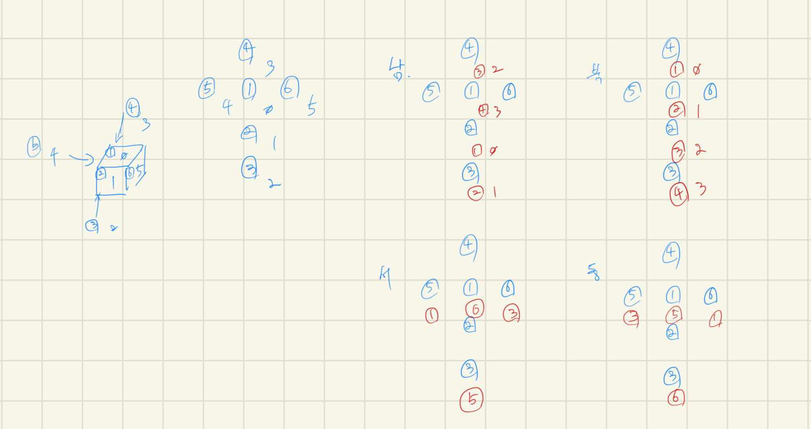

# [14499번: 주사위 굴리기](https://www.acmicpc.net/problem/14499)

크기가 N×M인 지도가 존재한다. 지도의 오른쪽은 동쪽, 위쪽은 북쪽이다. 이 지도의 위에 주사위가 하나 놓여져 있으며, 주사위의 전개도는 아래와 같다. 지도의 좌표는 (r, c)로 나타내며, r는 북쪽으로부터
떨어진 칸의 개수, c는 서쪽으로부터 떨어진 칸의 개수이다.

```text
  2
4 1 3
  5
  6
```

주사위는 지도 위에 윗 면이 1이고, 동쪽을 바라보는 방향이 3인 상태로 놓여져 있으며, 놓여져 있는 곳의 좌표는 (x, y) 이다. 가장 처음에 주사위에는 모든 면에 0이 적혀져 있다.

지도의 각 칸에는 정수가 하나씩 쓰여져 있다. 주사위를 굴렸을 때, 이동한 칸에 쓰여 있는 수가 0이면, 주사위의 바닥면에 쓰여 있는 수가 칸에 복사된다. 0이 아닌 경우에는 칸에 쓰여 있는 수가 주사위의 바닥면으로
복사되며, 칸에 쓰여 있는 수는 0이 된다.

주사위를 놓은 곳의 좌표와 이동시키는 명령이 주어졌을 때, 주사위가 이동했을 때 마다 상단에 쓰여 있는 값을 구하는 프로그램을 작성하시오.

주사위는 지도의 바깥으로 이동시킬 수 없다. 만약 바깥으로 이동시키려고 하는 경우에는 해당 명령을 무시해야 하며, 출력도 하면 안 된다.

## 입출력

### 입력

첫째 줄에 지도의 세로 크기 N, 가로 크기 M (1 ≤ N, M ≤ 20), 주사위를 놓은 곳의 좌표 x, y(0 ≤ x ≤ N-1, 0 ≤ y ≤ M-1), 그리고 명령의 개수 K (1 ≤ K ≤ 1,000)가
주어진다.

둘째 줄부터 N개의 줄에 지도에 쓰여 있는 수가 북쪽부터 남쪽으로, 각 줄은 서쪽부터 동쪽 순서대로 주어진다. 주사위를 놓은 칸에 쓰여 있는 수는 항상 0이다. 지도의 각 칸에 쓰여 있는 수는 10 미만의 자연수
또는 0이다.

마지막 줄에는 이동하는 명령이 순서대로 주어진다. 동쪽은 1, 서쪽은 2, 북쪽은 3, 남쪽은 4로 주어진다.

### 출력

이동할 때마다 주사위의 윗 면에 쓰여 있는 수를 출력한다.
만약 바깥으로 이동시키려고 하는 경우에는 해당 명령을 무시해야 하며, 출력도 하면 안 된다.

## 예제

### 예제 입력 1

```text
4 2 0 0 8
0 2
3 4
5 6
7 8
4 4 4 1 3 3 3 2
```

### 예제 출력 1

```text
0
0
3
0
0
8
6
3
```

### 예제 입력 2

```text
3 3 1 1 9
1 2 3
4 0 5
6 7 8
1 3 2 2 4 4 1 1 3
```

### 예제 출력 2

```text
0
0
0
3
0
1
0
6
0
```

### 예제 입력 3

```text
2 2 0 0 16
0 2
3 4
4 4 4 4 1 1 1 1 3 3 3 3 2 2 2 2
```

### 예제 출력 3

```text
0
0
0
0
```

### 예제 입력 4

```text
3 3 0 0 16
0 1 2
3 4 5
6 7 8
4 4 1 1 3 3 2 2 4 4 1 1 3 3 2 2
```

### 예제 출력 4

```text
0
0
0
6
0
8
0
2
0
8
0
2
0
8
0
2
```

## 알고리즘 분류

- 구현
- 시뮬레이션

## 시도

역시 문제를 이해하는데 30분은 걸린 것 같다.

이후, 게임이 어떻게 실행되는지 직접 그림을 그려 머릿속으로 그려보았고,
주사위를 어떻게 굴려야 할 지가 문제를 푸는데 중요하게 생각되는 부분인 것 같다.

고민을 해봤지만, 내 머리로는 주사위를 쉽게 굴릴 생각이 들지 않았고 검색을 해보았다.

인터넷에 검색 후 [AndroidTeacher](https://hongcoding.tistory.com/128)님의 블로그에서 turn하는 부분만 간단하게 느낌을 봤는데,
결국 그냥 일일이 방향을 돌려 다이스에 값을 대입하는 것으로 문제를 해결하셨고, 문제 해결 후 다른 사람들의 블로그를 보니 다른 사람들도 보통 그런 방법으로 해결한 것 같았다.

**AndroidTeacher**님의 블로그에서 함수의 흐름만 간단히 파악 후 직접 그려서 주사위가 어떻게 회전되는지 그려보았다.



처음에는 인덱스(동그라미 쳐진 숫자)와 예시로 들 주사위 값(그냥 숫자)을 함께 그렸었는데,
굳이 주사위 값을 확인할 필요 없이 인덱스의 변화만 확인하면 될 것 같다.

해당 그림을 바탕을 주사위 회전을 구현했다.

### 시도1(32412kb, 44ms)

dice의 값을 직접 변경하는 것 보다, 새로운 list를 return하는 것이 더 깔끔하고 유지보수 하기 좋아 보였다.

```python
# https://www.acmicpc.net/problem/14499
# 주사위 굴리기
import sys

input = sys.stdin.readline

DIRECTIONS = {1: (0, 1), 2: (0, -1), 3: (-1, 0), 4: (1, 0)}


def turn(d, direction):
    north, middle, south, bottom, west, east = d
    if direction == 1:  # east
        return [north, west, south, east, bottom, middle]
    elif direction == 2:  # west
        return [north, east, south, west, middle, bottom]
    elif direction == 3:  # south
        return [bottom, north, middle, south, west, east]
    elif direction == 4:  # north
        return [middle, south, bottom, north, west, east]
    else:
        return


dice = [0, 0, 0, 0, 0, 0]  # north, middle, south, bottom, west, east
N, M, x, y, K = map(int, input().split())  # 지도 크기 N(row), M(col), 주사위 위치 x, y, 명령어 갯수 K
graphs = [list(map(int, input().split())) for _ in range(N)]
commands = list(map(int, input().split()))
# N, M, x, y, K = [4, 2, 0, 0, 8]
# graphs = [[0, 2], [3, 4], [5, 6], [7, 8]]
# commands = [4, 4, 4, 1, 3, 3, 3, 2]
# N, M, x, y, K = [3, 3, 1, 1, 9]
# graphs = [[1, 2, 3], [4, 0, 5], [6, 7, 8]]
# commands = [1, 3, 2, 2, 4, 4, 1, 1, 3]

for command in commands:
    r, c = DIRECTIONS[command]
    if not (0 <= x + r < N and 0 <= y + c < M):
        continue

    dice = turn(dice, command)
    x, y = x + r, y + c

    if graphs[x][y] == 0:
        graphs[x][y] = dice[3]
    else:
        dice[3] = graphs[x][y]
        graphs[x][y] = 0

    print(dice[1])
```

## 정리
