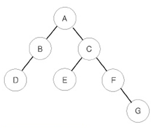

# [1991번: 트리 순회](https://www.acmicpc.net/problem/1991)

이진 트리를 입력받아 전위 순회(preorder traversal), 중위 순회(inorder traversal), 후위 순회(postorder traversal)한 결과를 출력하는 프로그램을 작성하시오.



예를 들어 위와 같은 이진 트리가 입력되면,

- 전위 순회한 결과 : ABDCEFG // (루트) (왼쪽 자식) (오른쪽 자식)
- 중위 순회한 결과 : DBAECFG // (왼쪽 자식) (루트) (오른쪽 자식)
- 후위 순회한 결과 : DBEGFCA // (왼쪽 자식) (오른쪽 자식) (루트)

가 된다.

## 입출력

### 입력

첫째 줄에는 이진 트리의 노드의 개수 N(1 ≤ N ≤ 26)이 주어진다.
둘째 줄부터 N개의 줄에 걸쳐 각 노드와 그의 왼쪽 자식 노드, 오른쪽 자식 노드가 주어진다.
노드의 이름은 A부터 차례대로 알파벳 대문자로 매겨지며, 항상 A가 루트 노드가 된다.
자식 노드가 없는 경우에는 .으로 표현한다.

### 출력

첫째 줄에 전위 순회, 둘째 줄에 중위 순회, 셋째 줄에 후위 순회한 결과를 출력한다.
각 줄에 N개의 알파벳을 공백 없이 출력하면 된다.

## 예제

### 예제 입력 1

```text
7
A B C
B D .
C E F
E . .
F . G
D . .
G . .
```

### 예제 출력 1

```text
ABDCEFG
DBAECFG
DBEGFCA
```

## 알고리즘 분류

- 트리
- 재귀

## 시도

### 시도1(32412kb, 32ms)

전위, 중위, 후위 순회를 어떻게 하는지 기억이 안 나서 인터넷에 검색해보았다.

[엔지니](https://m.blog.naver.com/rlakk11/60159303809)님 블로그를 보고 이해를 하였고,

마지막을 보니, 코드가 있어서 봤고, 데이터 구조 시간에 공부했었던 내용들이 기억나서 코드를 구현했다.

```python
# https://www.acmicpc.net/problem/1991
# 트리 순회
import sys

input = sys.stdin.readline


def preorder(graph, current):
    print(current, end='')
    l, r = graph[current]

    if l != ".":
        preorder(graph, l)

    if r != ".":
        preorder(graph, r)


def inorder(graph, current):
    l, r = graph[current]

    if l != ".":
        inorder(graph, l)

    print(current, end='')

    if r != ".":
        inorder(graph, r)


def postorder(graph, current):
    l, r = graph[current]

    if l != ".":
        postorder(graph, l)

    if r != ".":
        postorder(graph, r)

    print(current, end='')


N = int(input())
graphs = {}

for _ in range(N):
    parent, left, right = input().rstrip().split()
    graphs[parent] = [left, right]
# N = 7
# graphs = {"A": ["B", "C"], "B": ["D", "."], "C": ["E", "F"],
#           "E": [".", "."], "F": [".", "G"], "D": [".", "."], "G": [".", "."]}

preorder(graphs, list(graphs.keys())[0])
print()
inorder(graphs, list(graphs.keys())[0])
print()
postorder(graphs, list(graphs.keys())[0])
```
