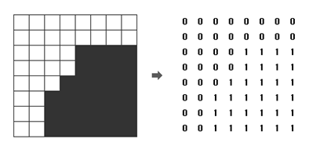

# [1992번: 쿼드트리](https://www.acmicpc.net/problem/1992)

흑백 영상을 압축하여 표현하는 데이터 구조로 쿼드 트리(Quad Tree)라는 방법이 있다. 흰 점을 나타내는 0과 검은 점을 나타내는 1로만 이루어진 영상(2차원 배열)에서 같은 숫자의 점들이 한 곳에 많이
몰려있으면, 쿼드 트리에서는 이를 압축하여 간단히 표현할 수 있다.

주어진 영상이 모두 0으로만 되어 있으면 압축 결과는 "0"이 되고, 모두 1로만 되어 있으면 압축 결과는 "1"이 된다. 만약 0과 1이 섞여 있으면 전체를 한 번에 나타내지를 못하고, 왼쪽 위, 오른쪽 위, 왼쪽
아래, 오른쪽 아래, 이렇게 4개의 영상으로 나누어 압축하게 되며, 이 4개의 영역을 압축한 결과를 차례대로 괄호 안에 묶어서 표현한다



위 그림에서 왼쪽의 영상은 오른쪽의 배열과 같이 숫자로 주어지며, 이 영상을 쿼드 트리 구조를 이용하여 압축하면 "(0(0011)(0(0111)01)1)"로 표현된다. N ×N 크기의 영상이 주어질 때, 이 영상을
압축한 결과를 출력하는 프로그램을 작성하시오.

## 입출력

### 입력

첫째 줄에는 영상의 크기를 나타내는 숫자 N 이 주어진다. N 은 언제나 2의 제곱수로 주어지며, 1 ≤ N ≤ 64의 범위를 가진다. 두 번째 줄부터는 길이 N의 문자열이 N개 들어온다. 각 문자열은 0 또는 1의 숫자로 이루어져 있으며, 영상의 각 점들을 나타낸다.

### 출력
영상을 압축한 결과를 출력한다.

## 예제

### 예제 입력 1

```text
8
11110000
11110000
00011100
00011100
11110000
11110000
11110011
11110011
```

### 예제 출력 1

```text
((110(0101))(0010)1(0001))
```

## 알고리즘 분류

- 분할 정복
- 재귀

## 시도

### 시도1(33432kb, 40ms)

문제가 이해가 안 돼서 [TML](https://velog.io/@cindy0857/백준-1992번-쿼드트리-Python-파이썬)님의 블로그를 보고 문제를 이해했다.

.png)를 보고, 계속해서 4등분으로 쪼개 나가야 한다는 것을 파악하고 코드를 직접 작성하게 되었다.

코드를 작성하면서 가장 고민했던 부분은 어떻게 4분면으로 쪼개서, 계속 재귀를 진행할 지가 고민이었고 가장 시간을 오래 썻던 것 같다.

또한, 코드를 작성하면서 이중 리스트에 대해 count를 진행했던 부분이다.
이중 리스트에 `list`의 내장 함수인 `count`를 적용하니, `count`가 작동하지 않았다. (어쩌면 당연한 결과)

그래서, 문자열로 저장했던 `graphs`를 숫자로 바꾸어 저장했고, `result`라는 변수에 리스트에 총합을 저장했다.  

```python
# https://www.acmicpc.net/problem/1992
# 쿼드트리
import sys

input = sys.stdin.readline


def search(graph, size):
    result = sum([sum(g) for g in graph])

    if result == 0:
        print(0, end='')
    elif result == size ** 2:
        print(1, end='')
    else:
        print("(", end='')
        search([graph[row][:size//2] for row in range(size // 2)], size // 2)
        search([graph[row][size//2:] for row in range(size // 2)], size // 2)
        search([graph[row][:size//2:] for row in range(size // 2, len(graph))], size // 2)
        search([graph[row][size//2:] for row in range(size // 2, len(graph))], size // 2)
        print(")", end='')


N = int(input())
graphs = [list(map(int, list(input().rstrip()))) for _ in range(N)]
# N = 8
# graphs = [list(map(int, list("11110000"))), list(map(int, list("11110000"))), list(map(int, list("00011100"))), list(map(int, list("00011100"))), list(map(int, list("11110000"))), list(map(int, list("11110000"))),
#           list(map(int, list("11110011"))), list(map(int, list("11110011")))]

search(graphs, N)
```

## 정리

이제 재귀의 기초는 어느 정도 익혀진 것 같다.
