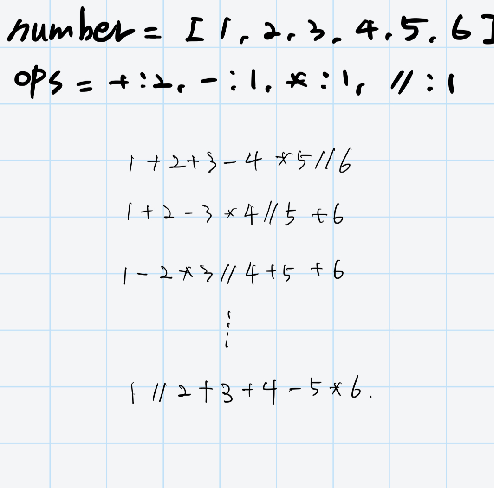

# 14888번: 연산자 끼워넣기

N개의 수로 이루어진 수열 A1, A2, ..., AN이 주어진다. 또, 수와 수 사이에 끼워넣을 수 있는 N-1개의 연산자가 주어진다. 연산자는 덧셈(+), 뺄셈(-), 곱셈(×), 나눗셈(÷)으로만 이루어져 있다.

우리는 수와 수 사이에 연산자를 하나씩 넣어서, 수식을 하나 만들 수 있다. 이때, 주어진 수의 순서를 바꾸면 안 된다.

예를 들어, 6개의 수로 이루어진 수열이 1, 2, 3, 4, 5, 6이고, 주어진 연산자가 덧셈(+) 2개, 뺄셈(-) 1개, 곱셈(×) 1개, 나눗셈(÷) 1개인 경우에는 총 60가지의 식을 만들 수 있다. 예를 들어, 아래와 같은 식을 만들 수 있다.

- 1+2+3-4×5÷6  
- 1÷2+3+4-5×6  
- 1+2÷3×4-5+6  
- 1÷2×3-4+5+6  

식의 계산은 연산자 우선 순위를 무시하고 앞에서부터 진행해야 한다. 또, 나눗셈은 정수 나눗셈으로 몫만 취한다. 음수를 양수로 나눌 때는 C++14의 기준을 따른다. 즉, 양수로 바꾼 뒤 몫을 취하고, 그 몫을 음수로 바꾼 것과 같다. 이에 따라서, 위의 식 4개의 결과를 계산해보면 아래와 같다.

- 1+2+3-4×5÷6 = 1
- 1÷2+3+4-5×6 = 12
- 1+2÷3×4-5+6 = 5
- 1÷2×3-4+5+6 = 7

N개의 수와 N-1개의 연산자가 주어졌을 때, 만들 수 있는 식의 결과가 최대인 것과 최소인 것을 구하는 프로그램을 작성하시오.

## 입출력

### 입력
첫째 줄에 수의 개수 N(2 ≤ N ≤ 11)가 주어진다. 둘째 줄에는 A1, A2, ..., AN이 주어진다. 
(1 ≤ Ai ≤ 100) 셋째 줄에는 합이 N-1인 4개의 정수가 주어지는데, 
차례대로 덧셈(+)의 개수, 뺄셈(-)의 개수, 곱셈(×)의 개수, 나눗셈(÷)의 개수이다.

### 출력

첫째 줄에 만들 수 있는 식의 결과의 최댓값을, 둘째 줄에는 최솟값을 출력한다. 
연산자를 어떻게 끼워넣어도 항상 -10억보다 크거나 같고, 10억보다 작거나 같은 결과가 나오는 입력만 주어진다. 
또한, 앞에서부터 계산했을 때, 중간에 계산되는 식의 결과도 항상 -10억보다 크거나 같고, 10억보다 작거나 같다.

## 예제

### 예제 입력 1

```text
2
5 6
0 0 1 0
```

### 예제 출력 1

```text
30
30
```

### 예제 입력 2

```text
3
3 4 5
1 0 1 0
```

### 예제 출력 2

```text
35
17
```

### 예제 입력 3

```text
6
1 2 3 4 5 6
2 1 1 1
```

### 예제 출력 3

```text
54
-24
```

## 힌트
세 번째 예제의 경우에 다음과 같은 식이 최댓값/최솟값이 나온다.

- 최댓값: 1-2÷3+4+5×6
- 최솟값: 1+2+3÷4-5×6

## 알고리즘 분류

- 브루트포스 알고리즘
- 백트래킹

## 시도

### 시도1(38048kb, 544ms)

어떻게 접근해야하지 하는 찰나에 다음과 같이 연산의 순열을 발견했다.



순열을 발견하고, 빠르게 테스트해보기 위해서 `itertools.permutations()`를 이용하여 문제를 해결해보았다.

```python
import sys
import itertools

input = sys.stdin.readline

N = int(input())
number = list(map(int, input().split()))
operators_count = list(map(int, input().split()))

OPERATOR_TYPES = ["+", "-", "*", "//"]
OPERATOR = {"+": lambda x, y: x + y, "-": lambda x, y: x - y,
            "*": lambda x, y: x * y, "//": lambda x, y: int(x / y)}
operators = []
for i in range(len(OPERATOR_TYPES)):
    if operators_count[i] > 0:
        for j in range(operators_count[i]):
            operators.append(OPERATOR_TYPES[i])

big = -10 ** 9
small = 10 ** 9

for permutation in set(itertools.permutations(operators, len(operators))):
    current = number[0]
    for i in range(len(permutation)):
        current = OPERATOR[permutation[i]](current, number[i + 1])
    if current > big:
        big = current
    if current < small:
        small = current

print(big, small, sep='\n')
```

### 시도2(시간 초과)

`itertools.permutations()`를 이용해 문제를 해결하였으니, 함수를 직접 만들어 테스트해보았다.

하지만, 정답은 잘 나오나, 연산의 갯수가 최대 44개가 나올 수 있기 때문에 그런지 시간 초과가 발생했다.

```python
import sys

input = sys.stdin.readline


def permutations(arr, size):
    result = []

    if size == 1:
        result.append([val for val in arr])

    elif 1 < size <= len(arr):
        for index in range(len(arr)):
            copy_arr = arr.copy()
            copy_arr.remove(arr[index])
            for p in permutations(copy_arr, size - 1):
                result.append([arr[index]] + p)

    return result


N = int(input())
number = list(map(int, input().split()))
operators_count = list(map(int, input().split()))
OPERATOR_TYPES = ["+", "-", "*", "//"]
OPERATOR = {"+": lambda x, y: x + y, "-": lambda x, y: x - y,
            "*": lambda x, y: x * y, "//": lambda x, y: int(x / y)}
operators = []
for i in range(len(OPERATOR_TYPES)):
    if operators_count[i] > 0:
        for j in range(operators_count[i]):
            operators.append(OPERATOR_TYPES[i])

big = -10 ** 9
small = 10 ** 9

for permutation in permutations(operators, len(operators)):
    current = number[0]
    for i in range(len(permutation)):
        current = OPERATOR[permutation[i]](current, number[i + 1])
    if current > big:
        big = current
    if current < small:
        small = current

print(big, small, sep='\n')
```

### 시도3(32544kb, 7560ms)

실행 시간이 엄청 걸리긴 했지만, 직접 구현한 순열로 구현한 코드

왜 오랜 시간이 걸리나 생각해봤고, 아마 배열을 복사하는데 시간을 많이 사용한다고 판단된다.

```python
import sys

input = sys.stdin.readline

OPERATOR = {"+": lambda x, y: x + y, "-": lambda x, y: x - y,
            "*": lambda x, y: x * y, "//": lambda x, y: int(x / y)}


def permutations(nums, ops, size, answer, repository=[]):
    if size == 0:
        result = nums[0]
        for index in range(len(repository)):
            result = OPERATOR[repository[index]](result, nums[index + 1])

        a, b = answer

        if result > a:
            answer[0] = result
        if result < b:
            answer[1] = result
        return

    for index in range(len(ops)):
        copy_ops = ops.copy()
        copy_ops.remove(ops[index])
        repository.append(ops[index])
        permutations(nums, copy_ops, size - 1, answer)
        repository.pop()


N = int(input())
number = list(map(int, input().split()))
operators_count = list(map(int, input().split()))

operators = []
for op, count in zip(["+", "-", "*", "//"], operators_count):
    operators += [op] * count

big = -10 ** 9
small = 10 ** 9

ans = [big, small]
permutations(number, operators, len(operators), ans)
print(ans[0], ans[1])
```

### 시도4(32412kb, 64ms)

[baduck](https://velog.io/@jsyun0412/Python%EB%B0%B1%EC%A4%80-14888-%EC%97%B0%EC%82%B0%EC%9E%90-%EB%81%BC%EC%9B%8C%EB%84%A3%EA%B8%B0)님의 블로그를 보고 참고한 코드이다.

계속해서 재귀를 돌면서 새로운 값으로 업데이트하고, 모든 값이 계산된 후에는 다시 값을 원상 복구하여 재사용한다. 

```python
# https://www.acmicpc.net/problem/14888
# 연산자 끼워넣기
#
import sys

input = sys.stdin.readline

ADD, SUB, MUL, DIV = 0, 1, 2, 3
OPERATE = {ADD: lambda x, y: x + y, SUB: lambda x, y: x - y,
           MUL: lambda x, y: x * y, DIV: lambda x, y: int(x / y)}


def permutations(nums, ops, idx, result, answer, count=0):
    count += 1
    if idx == len(nums):
        bigger, smaller = answer
        answer[0] = max(result, bigger)
        answer[1] = min(result, smaller)
        return

    if ops[ADD] > 0:
        ops[ADD] -= 1
        permutations(nums, ops, idx + 1, OPERATE[ADD](result, nums[idx]), answer)
        ops[ADD] += 1

    if ops[SUB] > 0:
        ops[SUB] -= 1
        permutations(nums, ops, idx + 1, OPERATE[SUB](result, nums[idx]), answer)
        ops[SUB] += 1

    if ops[MUL] > 0:
        ops[MUL] -= 1
        permutations(nums, ops, idx + 1, OPERATE[MUL](result, nums[idx]), answer)
        ops[MUL] += 1

    if ops[DIV] > 0:
        ops[DIV] -= 1
        permutations(nums, ops, idx + 1, OPERATE[DIV](result, nums[idx]), answer)
        ops[DIV] += 1


N = int(input())
operators = list(map(int, input().split()))
number = list(map(int, input().split()))

big = -10 ** 9
small = 10 ** 9

ans = [big, small]
permutations(number, operators, 1, number[0], ans)
print(ans[0], ans[1])
```