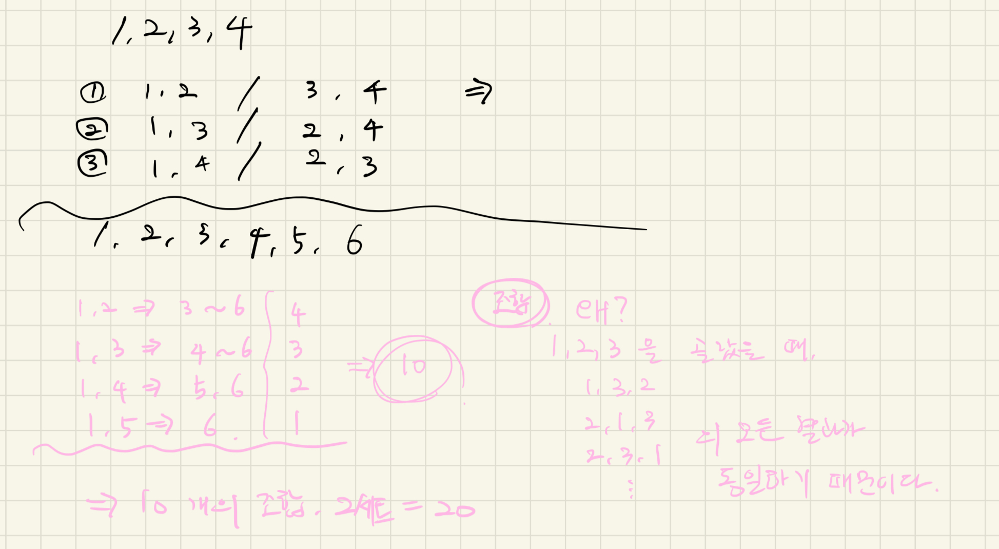

# 14889번: 스타트와 링크

오늘은 스타트링크에 다니는 사람들이 모여서 축구를 해보려고 한다. 축구는 평일 오후에 하고 의무 참석도 아니다. 축구를 하기 위해 모인 사람은 총 N명이고 신기하게도 N은 짝수이다. 이제 N/2명으로 이루어진 스타트
팀과 링크 팀으로 사람들을 나눠야 한다.

BOJ를 운영하는 회사 답게 사람에게 번호를 1부터 N까지로 배정했고, 아래와 같은 능력치를 조사했다. 능력치 Sij는 i번 사람과 j번 사람이 같은 팀에 속했을 때, 팀에 더해지는 능력치이다. 팀의 능력치는 팀에
속한 모든 쌍의 능력치 Sij의 합이다. Sij는 Sji와 다를 수도 있으며, i번 사람과 j번 사람이 같은 팀에 속했을 때, 팀에 더해지는 능력치는 Sij와 Sji이다.

N=4이고, S가 아래와 같은 경우를 살펴보자.

| --     | -- | -- |
|--------|----|----|
| ------ |
| ------ |

| i \ j | 1 | 2 | 3 | 4 |
|-------|---|---|---|---|
| 1     |   | 1 | 2 | 3 |
| 2     | 4 |   | 5 | 6 |
| 3     | 7 | 1 |   | 2 |
| 4     | 3 | 4 | 5 |

예를 들어, 1, 2번이 스타트 팀, 3, 4번이 링크 팀에 속한 경우에 두 팀의 능력치는 아래와 같다.

- 스타트 팀: S<sub>12</sub> + S<sub>21</sub> = 1 + 4 = 5
- 링크 팀: S<sub>34</sub> + S<sub>43</sub> = 2 + 5 = 7

1, 3번이 스타트 팀, 2, 4번이 링크 팀에 속하면, 두 팀의 능력치는 아래와 같다.

- 스타트 팀: S13 + S31 = 2 + 7 = 9
- 링크 팀: S24 + S42 = 6 + 4 = 10

축구를 재미있게 하기 위해서 스타트 팀의 능력치와 링크 팀의 능력치의 차이를 최소로 하려고 한다. 위의 예제와 같은 경우에는 1, 4번이 스타트 팀, 2, 3번 팀이 링크 팀에 속하면 스타트 팀의 능력치는 6, 링크
팀의 능력치는 6이 되어서 차이가 0이 되고 이 값이 최소이다.

## 입출력

### 입력

첫째 줄에 N(4 ≤ N ≤ 20, N은 짝수)이 주어진다. 둘째 줄부터 N개의 줄에 S가 주어진다. 각 줄은 N개의 수로 이루어져 있고, i번 줄의 j번째 수는 S<sub>ij</sub> 이다.
S<sub>ii</sub>는 항상 0이고, 나머지 S<sub>ij</sub>는 1보다 크거나 같고, 100보다 작거나 같은 정수이다.

### 출력

첫째 줄에 스타트 팀과 링크 팀의 능력치의 차이의 최솟값을 출력한다.

## 예제

### 예제 입력 1

```text
4
0 1 2 3
4 0 5 6
7 1 0 2
3 4 5 0
```

### 예제 출력 1

```text
0
```

### 예제 입력 2

```text
6
0 1 2 3 4 5
1 0 2 3 4 5
1 2 0 3 4 5
1 2 3 0 4 5
1 2 3 4 0 5
1 2 3 4 5 0
```

### 예제 출력 2

```text
2
```

### 예제 입력 3

```text
8
0 5 4 5 4 5 4 5
4 0 5 1 2 3 4 5
9 8 0 1 2 3 1 2
9 9 9 0 9 9 9 9
1 1 1 1 0 1 1 1
8 7 6 5 4 0 3 2
9 1 9 1 9 1 0 9
6 5 4 3 2 1 9 0
```

### 예제 출력 3

```text
1
```

## 힌트

예제 2의 경우에 (1, 3, 6), (2, 4, 5)로 팀을 나누면 되고,
예제 3의 경우에는 (1, 2, 4, 5), (3, 6, 7, 8)로 팀을 나누면 된다.

## 알고리즘 분류

- 브루트포스 알고리즘
- 백트래킹

## 시도

### 시도1(32412kb, 5728ms)

처음 문제를 접했을 때 사진과 같이 팀들이 정해지는 리스트를 만들어봤다.



팀들의 순서가 변경되어도 결국 결과는 동일하기 때문에, 알고리즘은 조합을 이용하여 접근하였다.

그런데, 팀을 반으로 나누기 때문에 8개의 팀에서 나오는 경우의 수를 2로 나누어야 중복이 발생하지 않는다.

어떻게 해야할지 고민하다가 마땅한 방법이 생각나지 않아서 일단 가장 쉽게 중복까지 계산한 코드

```python
# https://www.acmicpc.net/problem/14889
# 스타트와 링크
import sys
import itertools

input = sys.stdin.readline

N = int(input())
statistics = [list(map(int, (input().rstrip().split()))) for _ in range(N)]
# N = 4
# statistics = [
#     [0, 1, 2, 3],
#     [4, 0, 5, 6],
#     [7, 1, 0, 2],
#     [3, 4, 5, 0],
# ]

# N = 6
# statistics = [
#     [0, 1, 2, 3, 4, 5],
#     [1, 0, 2, 3, 4, 5],
#     [1, 2, 0, 3, 4, 5],
#     [1, 2, 3, 0, 4, 5],
#     [1, 2, 3, 4, 0, 5],
#     [1, 2, 3, 4, 5, 0],
# ]

# 1, 3, 6 == 1 + 3 + 5 == 9
# 2, 4, 5 == 4 + 2 + 4 == 10

# N = 8
# statistics = [
#     [0, 5, 4, 5, 4, 5, 4, 5],
#     [4, 0, 5, 1, 2, 3, 4, 5],
#     [9, 8, 0, 1, 2, 3, 1, 2],
#     [9, 9, 9, 0, 9, 9, 9, 9],
#     [1, 1, 1, 1, 0, 1, 1, 1],
#     [8, 7, 6, 5, 4, 0, 3, 2],
#     [9, 1, 9, 1, 9, 1, 0, 9],
#     [6, 5, 4, 3, 2, 1, 9, 0],
# ]

teams = [num for num in range(1, N + 1)]
visited = [False] * (N + 1)

answer = float('inf')
for combination in itertools.combinations(teams, N // 2):
    result = 0
    # print(combination)
    for c in itertools.combinations(combination, 2):
        i, j = c
        # print("i={}, j={}".format(i, j))
        result += statistics[i - 1][j - 1] + statistics[j - 1][i - 1]

    # print("=" * 30)

    # print(set(teams) - set(list(combination)))
    for c2 in itertools.combinations(set(teams) - set(list(combination)), 2):
        k, l = c2
        # print("k={}, l={}".format(k, l))
        result -= statistics[k - 1][l - 1] + statistics[l - 1][k - 1]

    # print(result)
    if answer > abs(result):
        answer = abs(result)

print(answer)
```

### 시도2

[Yummy Bytes](https://chaeyami.tistory.com/230)님의 블로그를 보고 작성한 코드

```python
if visited[i] and visited[j]:
                    start_team += arr[i][j]
                elif not visited[i] and not visited[j]:
                    link_team += arr[i][j]
```

에 대해서, [1][2] 인 경우와 [2][1]인 경우를 모두 더해서, 최솟 값을 구해준다.

내 코드의 경우에는 매 return 시 `min`의 값을 구해 비교해주어 풀었다.

```python
import sys

input = sys.stdin.readline

N = int(input())
statistics = [list(map(int, (input().rstrip().split()))) for _ in range(N)]


def backtracking(arr, start, size, visited):
    arr_size = len(arr)
    result = float('inf')

    if size == 0:
        start_team, link_team = 0, 0
        for i in range(arr_size):
            for j in range(arr_size):
                if i == j:  # i == j 인 경우는 모든 값이 0이긴 하지만, 그래도 continue 적용했음
                    continue

                if visited[i] and visited[j]:
                    start_team += arr[i][j]
                elif not visited[i] and not visited[j]:
                    link_team += arr[i][j]

        return min(result, abs(start_team - link_team))

    for current in range(start, arr_size):
        if not visited[current]:
            visited[current] = True
            result = min(result, backtracking(arr, current + 1, size - 1, visited))  # 조합이기 때문에 current + 1의 값을 넘겨준다.
            visited[current] = False

    return result


print(backtracking(statistics, 0, N // 2, [False] * (N + 1)))
```

### 시도3

```python

```

### 시도4

```python

```

## 정리

