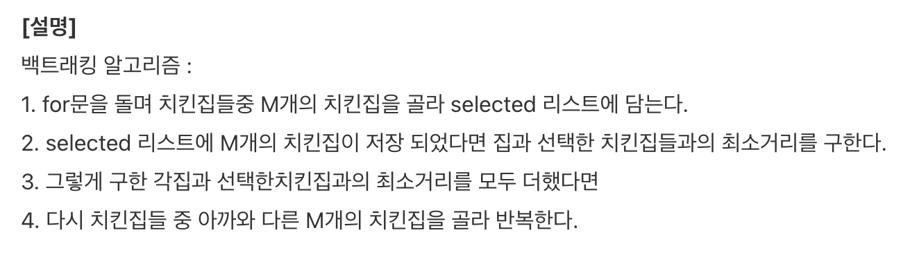

# 15686번: 치킨 배달

크기가 N×N인 도시가 있다. 도시는 1×1크기의 칸으로 나누어져 있다. 도시의 각 칸은 빈 칸, 치킨집, 집 중 하나이다. 도시의 칸은 (r, c)와 같은 형태로 나타내고, r행 c열 또는 위에서부터 r번째 칸, 왼쪽에서부터 c번째 칸을 의미한다. r과 c는 1부터 시작한다.

이 도시에 사는 사람들은 치킨을 매우 좋아한다. 따라서, 사람들은 "**치킨 거리**"라는 말을 주로 사용한다. **치킨 거리**는 집과 가장 가까운 치킨집 사이의 거리이다. 즉, **치킨 거리**는 집을 기준으로 정해지며, 각각의 집은 **치킨 거리**를 가지고 있다. **도시의 치킨 거리**는 모든 집의 **치킨 거리**의 합이다.

임의의 두 칸 (r1, c1)과 (r2, c2) 사이의 거리는 |r1-r2| + |c1-c2|로 구한다.

예를 들어, 아래와 같은 지도를 갖는 도시를 살펴보자.

```text
0 2 0 1 0
1 0 1 0 0
0 0 0 0 0
0 0 0 1 1
0 0 0 1 2
```
0은 빈 칸, 1은 집, 2는 치킨집이다.

(2, 1)에 있는 집과 (1, 2)에 있는 치킨집과의 거리는 |2-1| + |1-2| = 2, (5, 5)에 있는 치킨집과의 거리는 |2-5| + |1-5| = 7이다. 따라서, (2, 1)에 있는 집의 치킨 거리는 2이다.

(5, 4)에 있는 집과 (1, 2)에 있는 치킨집과의 거리는 |5-1| + |4-2| = 6, (5, 5)에 있는 치킨집과의 거리는 |5-5| + |4-5| = 1이다. 따라서, (5, 4)에 있는 집의 치킨 거리는 1이다.

이 도시에 있는 치킨집은 모두 같은 프랜차이즈이다. 프렌차이즈 본사에서는 수익을 증가시키기 위해 일부 치킨집을 폐업시키려고 한다. 오랜 연구 끝에 이 도시에서 가장 수익을 많이 낼 수 있는  치킨집의 개수는 최대 M개라는 사실을 알아내었다.

도시에 있는 치킨집 중에서 최대 M개를 고르고, 나머지 치킨집은 모두 폐업시켜야 한다. 
어떻게 고르면, 도시의 **치킨 거리**가 가장 작게 될지 구하는 프로그램을 작성하시오.

## 입출력

### 입력
첫째 줄에 N(2 ≤ N ≤ 50)과 M(1 ≤ M ≤ 13)이 주어진다.

둘째 줄부터 N개의 줄에는 도시의 정보가 주어진다.

도시의 정보는 0, 1, 2로 이루어져 있고, 0은 빈 칸, 1은 집, 2는 치킨집을 의미한다. 
집의 개수는 2N개를 넘지 않으며, 적어도 1개는 존재한다. 
치킨집의 개수는 M보다 크거나 같고, 13보다 작거나 같다.

### 출력
첫째 줄에 폐업시키지 않을 치킨집을 최대 M개를 골랐을 때, 도시의 치킨 거리의 최솟값을 출력한다.

## 예제

### 예제 입력 1

```text
5 3
0 0 1 0 0
0 0 2 0 1
0 1 2 0 0
0 0 1 0 0
0 0 0 0 2
```

### 예제 출력 1

```text
5
```

### 예제 입력 2

```text
5 2
0 2 0 1 0
1 0 1 0 0
0 0 0 0 0
2 0 0 1 1
2 2 0 1 2
```

### 예제 출력 2

```text
10
```

### 예제 입력 3

```text
5 1
1 2 0 0 0
1 2 0 0 0
1 2 0 0 0
1 2 0 0 0
1 2 0 0 0
```

### 예제 출력 3

```text
11
```

### 예제 입력 4

```text
5 1
1 2 0 2 1
1 2 0 2 1
1 2 0 2 1
1 2 0 2 1
1 2 0 2 1
```

### 예제 출력 4

```text
32
```

## 알고리즘 분류

- 구현
- 브루트포스 알고리즘
- 백트래킹

## 시도

### 시도1

처음 문제를 접했을 때,
예제 1의 입력에서 치킨집과 집의 가장 가까운 거리는 1인데 왜 예제 출력이 5인지 이해가 안 돼서, 
계속 고민하다가 결국 인터넷을 검색해봤다.

[studio.han](https://stdio-han.tistory.com/158)님의 설명을 보고 문제를 이해하게 되었다.

 

즉, 문제에서 요구하는 건 모든 집들과 치킨 집에서 구할 수 있는 최소 거리의 합이며, 문제에서 아래 부분을 제대로 읽지 않았었다.

`도시의 치킨 거리는 모든 집의 치킨 거리의 합`

블로그를 보다가 풀이법을 이미 봐버려서 알고리즘만 생각하여 문제는 어렵지않게 구현했다.

처음은 역시 `itertools.combinations()`을 이용해서 해결했다.

문제를 잘 읽자.

```python
# https://www.acmicpc.net/problem/15686
# 치킨 배달
import sys
import itertools

input = sys.stdin.readline

N, M = map(int, input().split())
cities = [list(map(int, input().split())) for _ in range(N)]
# N, M = 5, 3
# cities = [
#     [0, 0, 1, 0, 0],
#     [0, 0, 2, 0, 1],
#     [0, 1, 2, 0, 0],
#     [0, 0, 1, 0, 0],
#     [0, 0, 0, 0, 2],
# ]
# N, M = 5, 2
# cities = [
#     [0, 2, 0, 1, 0],
#     [1, 0, 1, 0, 0],
#     [0, 0, 0, 0, 0],
#     [2, 0, 0, 1, 1],
#     [2, 2, 0, 1, 2],
# ]
# N, M = 5, 1
# cities = [
#     [1, 2, 0, 0, 0],
#     [1, 2, 0, 0, 0],
#     [1, 2, 0, 0, 0],
#     [1, 2, 0, 0, 0],
#     [1, 2, 0, 0, 0],
# ]
# N, M = 5, 1
# cities = [
#     [1, 2, 0, 2, 1],
#     [1, 2, 0, 2, 1],
#     [1, 2, 0, 2, 1],
#     [1, 2, 0, 2, 1],
#     [1, 2, 0, 2, 1],
# ]
houses = []
chickens = []

for row in range(N):
    line = cities[row]
    for column in range(N):
        if line[column] == 1:
            houses.append((row, column))
        elif line[column] == 2:
            chickens.append((row, column))

answer = float('inf')
for index, combination in enumerate(itertools.combinations(chickens, M)):
    total = 0
    for house in houses:
        result = float('inf')
        house_row, house_col = house
        for chicken in combination:
            chicken_row, chicken_col = chicken
            current = abs(chicken_row - house_row) + abs(chicken_col - house_col)
            if result > current:
                result = current

        total += result

    if answer > total:
        answer = total

print(answer)
```

### 시도2(32414kb, 216ms)

직접 `backtracking()`을 구현하여 문제를 해결했다.

각 house에 대해 가장 가까운 chicken들을 구해야하기 때문에, 
1개의 house에서 조합의 결과로 나온 chicken들을 순회하며 `total`에 최소값을 담는다.

조합을 구하면서 값을 계산하기 때문에, `itertools.combinations()`을 이용하여 반복문을 다시 순회하는 것 보다
속도가 빠르다고 생각한다.

```python
import sys

input = sys.stdin.readline


def backtrack(house_list, chicken_list, start, size, repository=[], answer=float('inf')):
    if size == 0:
        result = 0
        for house in house_list:
            house_row, house_col = house
            total = float('inf')
            for chicken in repository:
                chicken_row, chicken_col = chicken
                total = min(total, abs(house_row - chicken_row) + abs(house_col - chicken_col))

            result += total
        return min(answer, result)

    for current in range(start, len(chicken_list)):
        if chicken_list[current] not in repository:
            repository.append(chicken_list[current])
            answer = min(answer, backtrack(house_list, chicken_list, current + 1, size - 1))
            repository.pop()

    return answer


N, M = map(int, input().split())
cities = [list(map(int, input().split())) for _ in range(N)]
houses = []
chickens = []

for row in range(N):
    line = cities[row]
    for column in range(N):
        if line[column] == 1:
            houses.append((row, column))
        elif line[column] == 2:
            chickens.append((row, column))

print(backtrack(houses, chickens, 0, M))
```

### 시도3

```python

```

### 시도4

```python

```

## 정리

