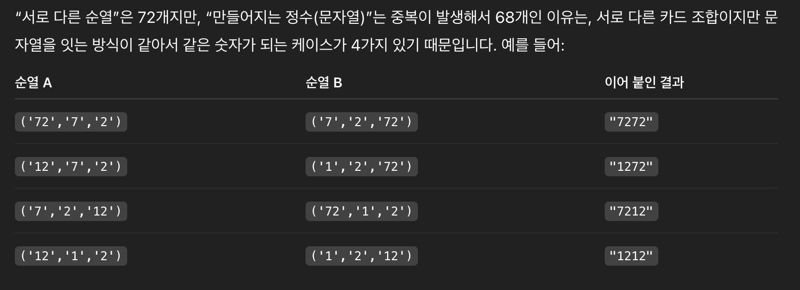

# 5568번: 카드 놓기

상근이는 카드 n(4 ≤ n ≤ 10)장을 바닥에 나란히 놓고 놀고있다. 각 카드에는 1이상 99이하의 정수가 적혀져 있다. 상근이는 이 카드 중에서 k(2 ≤ k ≤ 4)장을 선택하고, 가로로 나란히 정수를 만들기로 했다. 상근이가 만들 수 있는 정수는 모두 몇 가지일까?

예를 들어, 카드가 5장 있고, 카드에 쓰여 있는 수가 1, 2, 3, 13, 21라고 하자. 여기서 3장을 선택해서 정수를 만들려고 한다. 2, 1, 13을 순서대로 나열하면 정수 2113을 만들 수 있다. 또, 21, 1, 3을 순서대로 나열하면 2113을 만들 수 있다. 이렇게 한 정수를 만드는 조합이 여러 가지 일 수 있다.

n장의 카드에 적힌 숫자가 주어졌을 때, 그 중에서 k개를 선택해서 만들 수 있는 정수의 개수를 구하는 프로그램을 작성하시오.

## 입출력

### 입력
첫째 줄에 n이, 둘째 줄에 k가 주어진다. 셋째 줄부터 n개 줄에는 카드에 적혀있는 수가 주어진다.

### 출력
첫째 줄에 상근이가 만들 수 있는 정수의 개수를 출력한다.

## 예제

### 예제 입력 1

```text
4
2
1
2
12
1
```

### 예제 출력 1

```text
4
2
1
2
12
1
```

### 예제 입력 2

```text
6
3
72
2
12
7
2
1
```

### 예제 출력 2

```text
68
```

## 힌트

예제 1의 경우 상근이는 11, 12, 21, 112, 121, 122, 212을 만들 수 있다.

## 알고리즘 분류

- 자료 구조
- 브루토포스 알고리즘
- 해시를 사용한 집합과 맵
- 백트래킹

## 시도

### 시도1

처음 시작은 항상 간단하게 `itertools.permutations`를 이용하여 문제를 해결해보았다.

아래 코드와 같이 제출했을 때 오답이 나왔고, 예제2의 입력대로 실행해보니 정답인 `68`이 아닌 `72`가 출력되었다.

조금 생각해봤지만, 경우의 수가 너무 많아서 지피티에게 물어보아서 해결하기로 하였고, 물어본 결과

 

와 같은 답변을 주어서 이해할 수 있게 되었다.

```python
import sys
import itertools

input = sys.stdin.readline
n = int(input())
k = int(input())
number = [int(input()) for _ in range(n)]
answer = set()

print(len(set(itertools.permutations(number, k))))
```

### 시도2(33948kb, 36ms)

지피티의 말대로 서로 다른 튜플이지만, 문자열로 변환 시 중복이 발생한다고 하였으니
문자열로 저장하여 문제를 해결하였다.

```python
import sys
import itertools

input = sys.stdin.readline
n = int(input())
k = int(input())
numbers = [input().rstrip() for _ in range(n)]

answer = set()
for permutation in itertools.permutations(numbers, k):
    answer.add(''.join(permutation))

print(len(answer))
```

### 시도3(33948kb, 36ms)

직접 함수를 구현해서 해결

```python
import sys


def permutations(arr, size, result, visited, repository=[]):
    if size == 0:
        value = ''.join(repository)
        if value not in result:
            result.add(value)
        return

    for index, num in enumerate(arr):
        if not visited[index]:
            visited[index] = True
            repository.append(num)
            permutations(arr, size - 1, result, visited)
            repository.pop()
            visited[index] = False


input = sys.stdin.readline
n = int(input())
k = int(input())
numbers = [input().rstrip() for _ in range(n)]
answer = set()
permutations(numbers, k, answer, [False] * n)
print(len(answer))
```

### 시도4(33948kb, 32ms)

[e-juhee](https://e-juhee.tistory.com/entry/python-%EB%B0%B1%EC%A4%80-5568-%EC%B9%B4%EB%93%9C-%EB%86%93%EA%B8%B0-%EC%9E%AC%EA%B7%80-%ED%95%A8%EC%88%98-vs-itertools-%EB%B9%84%EA%B5%90)님의 블로그를 보고 깨달은 사실

내가 처음에 한 방식대로 해도 된다.

하지만, 문자열로 변환만 해주면 된다. 가장 빠름

```python
import sys
import itertools

input = sys.stdin.readline
n = int(input())
k = int(input())
number = [int(input()) for _ in range(n)]
answer = set()

print(len(set("".join(val) for val in itertools.permutations(number, k))))
```

## 정리

