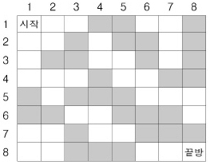

# [2665번: 미로만들기](https://www.acmicpc.net/problem/2665)

n×n 바둑판 모양으로 총 n2개의 방이 있다. 일부분은 검은 방이고 나머지는 모두 흰 방이다. 검은 방은 사면이 벽으로 싸여 있어 들어갈 수 없다. 서로 붙어 있는 두 개의 흰 방 사이에는 문이 있어서 지나다닐 수
있다. 윗줄 맨 왼쪽 방은 시작방으로서 항상 흰 방이고, 아랫줄 맨 오른쪽 방은 끝방으로서 역시 흰 방이다.

시작방에서 출발하여 길을 찾아서 끝방으로 가는 것이 목적인데, 아래 그림의 경우에는 시작방에서 끝 방으로 갈 수가 없다. 부득이 검은 방 몇 개를 흰 방으로 바꾸어야 하는데 되도록 적은 수의 방의 색을 바꾸고 싶다.

아래 그림은 n=8인 경우의 한 예이다.



위 그림에서는 두 개의 검은 방(예를 들어 (4,4)의 방과 (7,8)의 방)을 흰 방으로 바꾸면, 시작방에서 끝방으로 갈 수 있지만, 어느 검은 방 하나만을 흰 방으로 바꾸어서는 불가능하다. 검은 방에서 흰 방으로
바꾸어야 할 최소의 수를 구하는 프로그램을 작성하시오.

단, 검은 방을 하나도 흰방으로 바꾸지 않아도 되는 경우는 0이 답이다.

## 입출력

### 입력

첫 줄에는 한 줄에 들어가는 방의 수 n(1 ≤ n ≤ 50)이 주어지고, 다음 n개의 줄의 각 줄마다 0과 1이 이루어진 길이가 n인 수열이 주어진다. 0은 검은 방, 1은 흰 방을 나타낸다.

### 출력

첫 줄에 흰 방으로 바꾸어야 할 최소의 검은 방의 수를 출력한다.

## 예제

### 예제 입력 1

```text
8
11100110
11010010
10011010
11101100
01000111
00110001
11011000
11000111
```

### 예제 출력 1

```text
2
```

## 알고리즘 분류

- 그래프 이론
- 그래프 탐색
- 너비 우선 탐색
- 최단 경로
- 데이크스트라
- 격자 그래프
- 0-1 너비 우선 탐색

## 시도

### 시도1(시간 초과)

1인 길들을 이용하여 `N, N`까지 이동하는 문제이다.

처음 문제를 접했을 때, 가장 고민이 되는 부분은 0인 곳을 어떻게 찾아서 1로 초기화를 해야 할까에 대한 고민이였다.

그러다, [14502](./baekjoon_14502.md) 문제가 떠올랐고,  

```python
N = int(input())

# ...

for max_size in range(N * N):
    bfs(graphs, max_size, max_size)
```

을 이용하여 size를 0~ 최대 N^2 까지 방문하는 걸로 생각하여 문제를 해결해보았지만,
역시나 시간 초과가 발생했다.

```python
import sys
from collections import deque

input = sys.stdin.readline

DIRECTIONS = [(0, 1), (1, 0), (0, -1), (-1, 0)]

N = int(input())
graphs = [list(map(int, list(input()))) for _ in range(N)]


def bfs(graph, size, result):
    if size == 0:
        need_visited = deque([(0, 0)])
        visited = [[False] * N for _ in range(N)]
        visited[0][0] = True

        while need_visited:
            x, y = need_visited.popleft()

            for dx, dy in DIRECTIONS:
                row, col = x + dx, y + dy

                if 0 <= row < N and 0 <= col < N and graph[row][col] == 1 and not visited[row][col]:
                    visited[row][col] = True
                    need_visited.append((row, col))

        return visited[N - 1][N - 1]

    for i in range(N):
        for j in range(N):
            if graphs[i][j] == 0:
                graphs[i][j] = 1
                if bfs(graphs, size - 1, result):
                    print(result)
                    exit()
                graphs[i][j] = 0


for max_size in range(N * N):
    bfs(graphs, max_size, max_size)
```

### 시도2(35092kb, 60ms)

[dxxxwls](https://dxxxwls.tistory.com/98)님의 블로그를 보고 해결한 알고리즘 풀이 방법이다.

주석으로 이해한 코드를 설명해놓았음.

```python
# https://www.acmicpc.net/problem/2665
# 미로 만들기
import sys
from collections import deque

input = sys.stdin.readline

DIRECTIONS = [(0, 1), (1, 0), (0, -1), (-1, 0)]

N = int(input())
graphs = [list(map(int, list(input().rstrip()))) for _ in range(N)]
# N = 8
# graphs = [list(map(int, "11100110")), list(map(int, "11010010")), list(map(int, "10011010")),
#           list(map(int, "11101100")), list(map(int, "01000111")), list(map(int, "00110001")),
#           list(map(int, "11011000")), list(map(int, "11000111"))]


def bfs(graph):
    need_visited = deque([(0, 0)])
    visited = [[-1] * N for _ in range(N)]
    visited[0][0] = 0

    while need_visited:
        x, y = need_visited.popleft()

        if x == N - 1 and y == N - 1:
            break

        for dx, dy in DIRECTIONS:
            row, col = x + dx, y + dy

            if 0 <= row < N and 0 <= col < N and visited[row][col] == -1:  # 범위가 넘지 않고, 방문하지 않은 노드들에 대해 방문한다.
                if graph[row][col] == 1:  # 길이 이어져있다면 ?
                    need_visited.appendleft((row, col))  # 방문할 수 있는 길들을 이용하여 먼저 탐색하기 위해 appendleft
                    visited[row][col] = visited[x][y]  # 방문할 수 있는 길이기 때문에 따로 추가할 필요는 없다.
                else:  # 0이라면 ?
                    need_visited.append((row, col))  # 마지막에 탐색
                    visited[row][col] = visited[x][y] + 1  # 1을 1개 늘렸기 때문에, + 1

    print(visited[N - 1][N - 1])

    
bfs(graphs)
```
