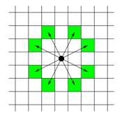

# 7562번: 나이트의 이동

체스판 위에 한 나이트가 놓여져 있다. 나이트가 한 번에 이동할 수 있는 칸은 아래 그림에 나와있다. 나이트가 이동하려고 하는 칸이 주어진다. 나이트는 몇 번 움직이면 이 칸으로 이동할 수 있을까?




## 입출력

### 입력

입력의 첫째 줄에는 테스트 케이스의 개수가 주어진다.

각 테스트 케이스는 세 줄로 이루어져 있다. 첫째 줄에는 체스판의 한 변의 길이 l(4 ≤ l ≤ 300)이 주어진다. 체스판의 크기는 l × l이다. 체스판의 각 칸은 두 수의 쌍 {0, ..., l-1} × {0, ..., l-1}로 나타낼 수 있다. 둘째 줄과 셋째 줄에는 나이트가 현재 있는 칸, 나이트가 이동하려고 하는 칸이 주어진다.

### 출력

각 테스트 케이스마다 나이트가 최소 몇 번만에 이동할 수 있는지 출력한다.

## 예제

### 예제 입력 1

```text
3
8
0 0
7 0
100
0 0
30 50
10
1 1
1 1
```

### 예제 출력 1

```text
5
28
0
```

### 예제 입력 2

```text

```

### 예제 출력 2

```text

```

## 시도

### 시도1(시간 초과)

BFS로 해결을 해보려 했고, 시간 초과 

아마 need_visited에 계속해서 값들이 추가되기 때문에 그런 것 같다.

300(l의 최대 길이) * 300(l의 최대 길이) * 300(need_visited가 추가될 수 있는 대략적인 길이)
를 하면 27_000_000이 나오기 떄문에 그런 것 같다. 

```python
# https://www.acmicpc.net/problem/7562
# 나이트의 이동
import sys
from collections import deque

input = sys.stdin.readline
DIRECTIONS = [(-2, 1), (-1, 2), (1, 2), (2, 1), (2, -1), (1, -2), (-1, -2), (-2, -1)]


def bfs(graph, start, length):
    need_visited = deque([start])

    while need_visited:
        x, y = need_visited.popleft()
        for dx, dy in DIRECTIONS:
            row, col = x + dx, y + dy
            if 0 <= row < length and 0 <= col < length:
                current = graph[row][col]
                if current > graph[x][y] + 1:
                    need_visited.appendleft((row, col))
                    graph[row][col] = min(graph[x][y] + 1, current)


T = int(input())

for _ in range(T):
    L = int(input())
    current_position = list(map(int, input().split()))
    destination = list(map(int, input().split()))
    graphs = [[999999] * L for _ in range(L)]
    graphs[current_position[0]][current_position[1]] = 0
    bfs(graphs, current_position, L)
    print(graphs[destination[0]][destination[1]])

```

### 시도2(정답)

더 좋은 방법이 있는지 [다른 블로그](https://velog.io/@falling_star3/백준Python-7562번-나이트의-이동)를 찾아봤는데,
방문한 노드는 다시 방문하지 않고 있었다.

DP처럼 최솟값이 계속 업데이트 될 것이라고  생각헀는데,
다시 생각해보니 노드를 다시 방문하게 되면, 그건 최솟값이 나올 수 없다. (왜 ? 현재 최솟값에서 해당 노드를 방문하는 것이기 때문에 -> 
다른 노드에서 방문했을 땐 어차피 값이 더 큼)

수정하여 제출해보니 정답

```python
# https://www.acmicpc.net/problem/7562
# 나이트의 이동
import sys
from collections import deque

input = sys.stdin.readline
DIRECTIONS = [(-2, 1), (-1, 2), (1, 2), (2, 1), (2, -1), (1, -2), (-1, -2), (-2, -1)]


def bfs(graph, start, length):
    need_visited = deque([start])

    while need_visited:
        x, y = need_visited.popleft()
        for dx, dy in DIRECTIONS:
            row, col = x + dx, y + dy
            if 0 <= row < length and 0 <= col < length and graph[row][col] == 0:
                need_visited.append((row, col))
                graph[row][col] = graph[x][y] + 1


T = int(input())

for _ in range(T):
    L = int(input())
    current_position = list(map(int, input().split()))
    destination = list(map(int, input().split()))
    graphs = [[0] * L for _ in range(L)]

    if current_position == destination:
        print(0)
    else:
        bfs(graphs, current_position, L)
        print(graphs[destination[0]][destination[1]])
        # print(graphs[destination[0] - 1][destination[1] - 1])

```

## 정리

