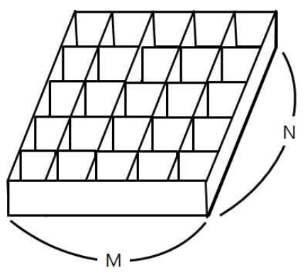

# [7576번: 토마토](https://www.acmicpc.net/problem/7576)

철수의 토마토 농장에서는 토마토를 보관하는 큰 창고를 가지고 있다. 토마토는 아래의 그림과 같이 격자 모양 상자의 칸에 하나씩 넣어서 창고에 보관한다.



창고에 보관되는 토마토들 중에는 잘 익은 것도 있지만, 아직 익지 않은 토마토들도 있을 수 있다. 보관 후 하루가 지나면, 익은 토마토들의 인접한 곳에 있는 익지 않은 토마토들은 익은 토마토의 영향을 받아 익게
된다. 하나의 토마토의 인접한 곳은 왼쪽, 오른쪽, 앞, 뒤 네 방향에 있는 토마토를 의미한다. 대각선 방향에 있는 토마토들에게는 영향을 주지 못하며, 토마토가 혼자 저절로 익는 경우는 없다고 가정한다. 철수는
창고에 보관된 토마토들이 며칠이 지나면 다 익게 되는지, 그 최소 일수를 알고 싶어 한다.

토마토를 창고에 보관하는 격자모양의 상자들의 크기와 익은 토마토들과 익지 않은 토마토들의 정보가 주어졌을 때, 며칠이 지나면 토마토들이 모두 익는지, 그 최소 일수를 구하는 프로그램을 작성하라. 단, 상자의 일부
칸에는 토마토가 들어있지 않을 수도 있다.

## 입출력

### 입력

첫 줄에는 상자의 크기를 나타내는 두 정수 M,N이 주어진다. M은 상자의 가로 칸의 수, N은 상자의 세로 칸의 수를 나타낸다. 단, 2 ≤ M,N ≤ 1,000 이다. 둘째 줄부터는 하나의 상자에 저장된
토마토들의 정보가 주어진다. 즉, 둘째 줄부터 N개의 줄에는 상자에 담긴 토마토의 정보가 주어진다. 하나의 줄에는 상자 가로줄에 들어있는 토마토의 상태가 M개의 정수로 주어진다. 정수 1은 익은 토마토, 정수 0은
익지 않은 토마토, 정수 -1은 토마토가 들어있지 않은 칸을 나타낸다.

토마토가 하나 이상 있는 경우만 입력으로 주어진다.

### 출력

여러분은 토마토가 모두 익을 때까지의 최소 날짜를 출력해야 한다. 만약, 저장될 때부터 모든 토마토가 익어있는 상태이면 0을 출력해야 하고, 토마토가 모두 익지는 못하는 상황이면 -1을 출력해야 한다.

## 예제 1

### 예제 입력 1

```text
6 4
0 0 0 0 0 0
0 0 0 0 0 0
0 0 0 0 0 0
0 0 0 0 0 1
```

### 예제 출력 1

```text
8
```

### 예제 2

### 예제 입력 2

```text
6 4
0 -1 0 0 0 0
-1 0 0 0 0 0
0 0 0 0 0 0
0 0 0 0 0 1
```

### 예제 출력 2

```text
-1
```

### 예제 3

### 예제 입력 3

```text
6 4
0 -1 0 0 0 0
-1 0 0 0 0 0
0 0 0 0 0 0
0 0 0 0 0 1
```

### 예제 출력 3

```text
6
```

### 예제 4

### 예제 입력 4

```text
5 5
-1 1 0 0 0
0 -1 -1 -1 0
0 -1 -1 -1 0
0 -1 -1 -1 0
0 0 0 0 0
```

### 예제 출력 4

```text
14
```

### 예제 5

### 예제 입력 5

```text
2 2
1 -1
-1 1
```

### 예제 출력 5

```text
0
```

## 문제 풀이

### 시도 1

1. 전체를 순회하고, 1이 있는 경우 주변에 0이 있는 곳을 찾는다.
2. 만약 주변에 0이 하나도 없이 bfs가 끝났다면 ? break
3. 주변에 0이 있이 끝났다면, 1번-3번 반복
4. 반복문이 종료됐는데 graph에 0이 남아있으면 -1

#### 결과

시간 초과가 떴음  
아마 제한 시간은 1초이지만, 
M, N이 최대 1,000이라서 이중 빈복문이면 (1000 * 1000) * (1000 * 1000) 이라서 그런 것 같음 
(간단하게 찾아보니 파이썬은 1초에 대략 2,000만 번의 연산이 가능하다고 함.)

#### 코드

```python
# https://www.acmicpc.net/problem/7576
# 토마토
from collections import deque
from sys import stdin

input = stdin.readline

DIRECTIONS = [(0, 1), (1, 0), (0, -1), (-1, 0)]

N, M = map(int, input().split())  # 세로 수, 가로 수
graphs = [list(map(int, input().split())) for _ in range(M)]
need_visited = deque()
answer = 0

for index in range(M * N):
    for current in range(M * N):
        row, col = current // N, current % N
        if graphs[row][col] == 1:
            for dx, dy in DIRECTIONS:
                x, y = row + dx, col + dy
                if 0 <= x < M and 0 <= y < N and graphs[x][y] == 0:
                    need_visited.append((x, y))
    if not need_visited:
        break
    else:
        answer += 1
        while need_visited:
            r, c = need_visited.popleft()
            graphs[r][c] = 1

for graph in graphs:
    if 0 in graph:
        answer = -1
        break
print(answer)
```

### 시도 2

[백준 질문](https://www.acmicpc.net/board/view/32980)을 참고하고 (연관성은 없음) list를 한 개 더 만들어서
need_visited(미래에 가야할 곳들을 저장), to_go_list(현재 가야할 곳들을 저장) 문제를 해결해 봤으나  
결국 시간 초과임

#### 결과
#### 코드

```python
# https://www.acmicpc.net/problem/7576
# 토마토
from collections import deque
from sys import stdin

input = stdin.readline

DIRECTIONS = [(0, 1), (1, 0), (0, -1), (-1, 0)]

N, M = map(int, input().split())  # 세로 수, 가로 수
graphs = [list(map(int, input().split())) for _ in range(M)]
need_visited = deque()
answer = 0

for index in range(M * N):
    row, col = index // N, index % N
    if graphs[row][col] == 1:
        need_visited.append((row, col))


to_go_list = deque()
while need_visited:
    while need_visited:
        to_go_list.append(need_visited.popleft())

    while to_go_list:
        row, col = to_go_list.popleft()
        for dx, dy in DIRECTIONS:
            x, y = row + dx, col + dy
            if (0 <= x < M and 0 <= y < N
                    and graphs[x][y] == 0 and (x, y) not in need_visited):
                    need_visited.append((x, y))
                    graphs[x][y] = 1

    if need_visited:
        answer += 1  # 처음 순환하는 것도 포함하기 때문에 갈 곳이 남은 경우에만 answer + 1

for graph in graphs:
    if 0 in graph:
        answer = -1
        break
print(answer)
```

### 시도 3

[티스토리 블로그](https://suminig.tistory.com/15)를 간단히 눈으로만 참고해서 DP 방식과 같은 느낌으로 풀어봤음

#### 결과

시간초과

#### 코드

```python
# https://www.acmicpc.net/problem/7576
# 토마토
from collections import deque
from sys import stdin

input = stdin.readline

DIRECTIONS = [(0, 1), (1, 0), (0, -1), (-1, 0)]

N, M = map(int, input().split())  # 세로 수, 가로 수
graphs = [list(map(int, input().split())) for _ in range(M)]
need_visited = deque()
answer = 0

for index in range(M * N):
    row, col = index // N, index % N
    if graphs[row][col] == 1:
        need_visited.append((row, col))


while need_visited:
    row, col = need_visited.popleft()
    for dx, dy in DIRECTIONS:
        x, y = row + dx, col + dy
        if (0 <= x < M and 0 <= y < N
                and graphs[x][y] == 0 and (x, y) not in need_visited):
                need_visited.append((x, y))
                graphs[x][y] += 1 + graphs[row][col]

for graph in graphs:
    current_max = max(graph)
    if answer < current_max:
        answer = current_max
    if 0 in graph:
        answer = -1
        break

print(answer - 1)

```

### 시도 4 (정답)

시도 3에서 시간 초과가 발생한 이유는 아래 코드 때문임 
```python
(x, y) not in need_visited
```
need_visited를 1번 더 조회해야 해서 시간 초과가 발생함
 
따라서 위 코드를 빼고, 기존에 0이 있는지와 토마토의 최댓값을 구하는 부분을 이중 반복문으로 수정

#### 결과

정답

#### 코드

```python
# https://www.acmicpc.net/problem/7576
# 토마토
from collections import deque
from sys import stdin

input = stdin.readline

DIRECTIONS = [(0, 1), (1, 0), (0, -1), (-1, 0)]

N, M = map(int, input().split())  # 세로 수, 가로 수
graphs = [list(map(int, input().split())) for _ in range(M)]
need_visited = deque()

for index in range(M * N):
    row, col = index // N, index % N
    if graphs[row][col] == 1:
        need_visited.append((row, col))

while need_visited:
    row, col = need_visited.popleft()
    for dx, dy in DIRECTIONS:
        x, y = row + dx, col + dy
        if 0 <= x < M and 0 <= y < N and graphs[x][y] == 0:
                need_visited.append((x, y))
                graphs[x][y] = 1 + graphs[row][col]

answer = 0
for graph in graphs:
    for tomato in graph:
        if tomato == 0:
            print(-1)
            exit()
        if answer < tomato:
            answer = tomato

print(answer - 1)
```