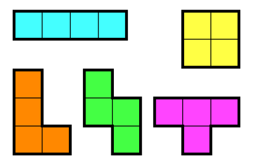

# [14500번: 테트로미노](https://www.acmicpc.net/problem/14500)

폴리오미노란 크기가 1×1인 정사각형을 여러 개 이어서 붙인 도형이며, 다음과 같은 조건을 만족해야 한다.

정사각형은 서로 겹치면 안 된다.
도형은 모두 연결되어 있어야 한다.
정사각형의 변끼리 연결되어 있어야 한다. 즉, 꼭짓점과 꼭짓점만 맞닿아 있으면 안 된다.
정사각형 4개를 이어 붙인 폴리오미노는 테트로미노라고 하며, 다음과 같은 5가지가 있다.



아름이는 크기가 N×M인 종이 위에 테트로미노 하나를 놓으려고 한다. 종이는 1×1 크기의 칸으로 나누어져 있으며, 각각의 칸에는 정수가 하나 쓰여 있다.

테트로미노 하나를 적절히 놓아서 테트로미노가 놓인 칸에 쓰여 있는 수들의 합을 최대로 하는 프로그램을 작성하시오.

테트로미노는 반드시 한 정사각형이 정확히 하나의 칸을 포함하도록 놓아야 하며, 회전이나 대칭을 시켜도 된다.

## 입출력

### 입력

첫째 줄에 종이의 세로 크기 N과 가로 크기 M이 주어진다. (4 ≤ N, M ≤ 500)

둘째 줄부터 N개의 줄에 종이에 쓰여 있는 수가 주어진다. i번째 줄의 j번째 수는 위에서부터 i번째 칸, 왼쪽에서부터 j번째 칸에 쓰여 있는 수이다. 입력으로 주어지는 수는 1,000을 넘지 않는 자연수이다.

### 출력

첫째 줄에 테트로미노가 놓인 칸에 쓰인 수들의 합의 최댓값을 출력한다.

## 예제

### 예제 입력 1

```text
5 5
1 2 3 4 5
5 4 3 2 1
2 3 4 5 6
6 5 4 3 2
1 2 1 2 1
```

### 예제 출력 1

```text
19
```

### 예제 입력 2

```text
4 5
1 2 3 4 5
1 2 3 4 5
1 2 3 4 5
1 2 3 4 5
```

### 예제 출력 2

```text
20
```

### 예제 입력 3

```text
4 10
1 2 1 2 1 2 1 2 1 2
2 1 2 1 2 1 2 1 2 1
1 2 1 2 1 2 1 2 1 2
2 1 2 1 2 1 2 1 2 1
```

### 예제 출력 3

```text
7
```

## 알고리즘 분류

- 구현
- 브루트포스 알고리즘

## 시도

### 시도1(38476kb, 2640ms)

테트리스 모양의 블럭중(대칭, 회전 포함) 1개를 그래프에 넣어서 해당 부분을 차지하는 값들의 합이 가장 큰 값을 고르는 문제이다.

테트리스 블럭 모양을 어떤 방법으로 구현을 시킬지 고민하다가, 마땅한 방법이 생각나지 않아서 알고리즘 분류를 봤더니 브루트포스 알고리즘이고,
N과 M이 최대 500이어서 완전 탐색으로 풀 수 있겠다 생각돼 모든 블럭을 직접 하드코딩하여 문제를 해결해봤다.

```python
# https://www.acmicpc.net/problem/14500
# 테트로미노
import sys

input = sys.stdin.readline

N, M = map(int, input().split())
graphs = [list(map(int, input().split())) for _ in range(N)]


# N, M = 5, 5
# graphs = [
#     [1, 2, 3, 4, 5],
#     [5, 4, 3, 2, 1],
#     [2, 3, 4, 5, 6],
#     [6, 5, 4, 3, 2],
#     [1, 2, 1, 2, 1]
# ]


def calculate(arr, current, position):
    x, y = current
    result = 0
    for dx, dy in position:
        row, col = x + dx, y + dy
        if not (0 <= row < N and 0 <= col < M):
            return -1
        result += arr[row][col]
    return result


def find_max(arr, current):
    return max([calculate(arr, current, [(0, 0), (0, 1), (0, 2), (0, 3)]),  # 1자 가로
                calculate(arr, current, [(0, 0), (1, 0), (2, 0), (3, 0)]),  # 1자 세로
                calculate(arr, current, [(0, 0), (1, 0), (1, 1), (0, 1)]),  # ㅁ
                calculate(arr, current, [(0, 0), (1, 0), (2, 0), (2, 1)]),  # ㄴ(1)
                calculate(arr, current, [(0, 0), (1, 0), (0, 1), (0, 2)]),  # ㄴ(2)
                calculate(arr, current, [(0, 0), (0, 1), (1, 1), (2, 1)]),  # ㄴ(3)
                calculate(arr, current, [(0, 0), (1, 0), (1, -1), (1, -2)]),  # ㄴ(4)
                calculate(arr, current, [(0, 0), (1, 0), (2, 0), (2, -1)]),  # 대칭 ㄴ(1)
                calculate(arr, current, [(0, 0), (1, 0), (1, 1), (1, 2)]),  # 대칭 ㄴ(2)
                calculate(arr, current, [(0, 0), (0, 1), (1, 0), (2, 0)]),  # 대칭 ㄴ(3)
                calculate(arr, current, [(0, 0), (0, 1), (0, 2), (1, 2)]),  # 대칭 ㄴ(4)
                calculate(arr, current, [(0, 0), (1, 0), (1, 1), (2, 1)]),  # 회전 ㄹ(1)
                calculate(arr, current, [(0, 0), (0, 1), (-1, 1), (-1, 2)]),  # 회전 ㄹ(2)
                calculate(arr, current, [(0, 0), (1, 0), (1, -1), (2, -1)]),  # 대칭 ㄹ(1)
                calculate(arr, current, [(0, 0), (0, 1), (1, 1), (1, 2)]),  # 대칭 ㄹ(2)
                calculate(arr, current, [(0, 0), (0, 1), (1, 1), (0, 2)]),  # ㅗ(1)
                calculate(arr, current, [(0, 0), (1, 0), (1, -1), (2, 0)]),  # ㅗ(2)
                calculate(arr, current, [(0, 0), (0, 1), (-1, 1), (0, 2)]),  # ㅗ(3)
                calculate(arr, current, [(0, 0), (1, 0), (1, 1), (2, 0)])])  # ㅗ(4)


answer = 0
for i in range(N):
    for j in range(M):
        answer = max(answer, find_max(graphs, (i, j)))

print(answer)
```

### 시도2(오답)

[만서다](https://jominseoo.tistory.com/96)님의 블로그를 보고 작성한 코드이다.

아무리 봐도 빡구현 완탐은 적절한 답이 아닌 것 같아서 다른 사람들의 코드를 검색해봤다.

백트래킹을 이용해서 인덱스 4개를 방문하면(4개의 블록으로 만들 수 있는 모양들이 다 나옴) 해당 값들의 결과로 max 값을 찾는 것이다.

대충 느낌만 보고 직접 구현을 해봤지만, 오답이 나왔다.

입력을 대충 돌려보고 정답을 제출했어서 무슨 오답인지 예제 입력 3을 입력했더니

```text
4 10
1 2 1 2 1 2 1 2 1 2
2 1 2 1 2 1 2 1 2 1
1 2 1 2 1 2 1 2 1 2
2 1 2 1 2 1 2 1 2 1
```

의 입력 결과로 답이`7`이 아닌 `6`이 나왔다.

눈으로 조금 살펴보니 `ㅜ` 모양의 블록을 검색하지 못 하는 것 같았다.

```text
발견하지 못 한 답의 모양

2 1 2
x 2 x 
```

머릿속으로 코드를 대충 돌려보니 현재 코드에서는 아무리 봐도 `ㅗ` 처럼 중간에 옆으로 뻗어나갈 수 있는 방법은 없었다.

일단은 오답

```python
import sys

input = sys.stdin.readline
BLOCK_SIZE = 4
DIRECTIONS = [(0, 1), (1, 0), (0, -1), (-1, 0)]

N, M = map(int, input().split())
graphs = [list(map(int, input().split())) for _ in range(N)]


def back_tracking(blocks, visited, start, current, size):
    if size == 0:
        return current

    result = 0
    x, y = start
    for dx, dy in DIRECTIONS:
        row, col = x + dx, y + dy
        if 0 <= row < N and 0 <= col < M and not visited[row][col]:
            visited[row][col] = True
            result = max(result, back_tracking(blocks, visited, (row, col), current + blocks[row][col], size - 1))
            visited[row][col] = False

    return result


v = [[False] * M for _ in range(N)]
answer = 0
for i in range(N):
    for j in range(M):
        answer = max(answer, back_tracking(graphs, v, (i, j), 0, BLOCK_SIZE))

print(answer)
```

### 시도3(116360kb, 1164ms, pypy3)

결국, **민서다**님의 블로그를 다시 봐보니, 현재의 위치에서 시작을 하고, 방문한 곳을 시작 위치에 리스트로 추가로 삽입해서 계속해서 탐색하는 것이었다.

이렇게 하면 중간에 옆으로 전환할 수 있는 모양이 생기니 `ㅗ` 모양을 만들 수 있는 것이었다.

```python
# https://www.acmicpc.net/problem/14500
# 테트로미노
import sys

input = sys.stdin.readline
BLOCK_SIZE = 4
DIRECTIONS = [(0, 1), (1, 0), (0, -1), (-1, 0)]

N, M = map(int, input().split())
graphs = [list(map(int, input().split())) for _ in range(N)]


# N, M = 5, 5
# graphs = [
#     [1, 2, 3, 4, 5],
#     [5, 4, 3, 2, 1],
#     [2, 3, 4, 5, 6],
#     [6, 5, 4, 3, 2],
#     [1, 2, 1, 2, 1]
# ]


def back_tracking(blocks, visited, start, current, size):
    if size == 0:
        return current

    result = 0
    for x, y in start:
        for dx, dy in DIRECTIONS:
            row, col = x + dx, y + dy
            if 0 <= row < N and 0 <= col < M and not visited[row][col]:
                visited[row][col] = True
                result = max(result,
                             back_tracking(blocks, visited, start + [(row, col)], current + blocks[row][col], size - 1))
                visited[row][col] = False

    return result


v = [[False] * M for _ in range(N)]
answer = 0
for i in range(N):
    for j in range(M):
        v[i][j] = True
        answer = max(answer, back_tracking(graphs, v, [(i, j)], graphs[i][j], BLOCK_SIZE - 1))

print(answer)
```

## 정리 및 소감

아직 많이 부족하다.

알고리즘을 더 자유자재로 이용할 수 있어야 할 것 같다.
