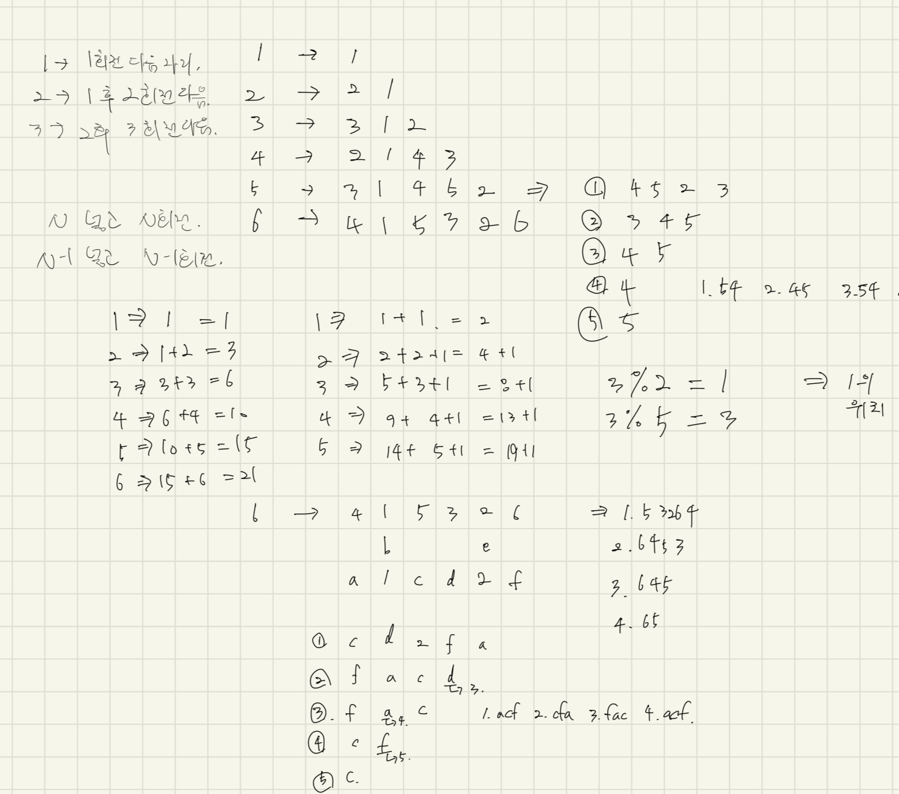

# [1835번: 카드](https://www.acmicpc.net/problem/1835)

1부터 N까지의 숫자가 적힌 카드가 있다. 찬유는 이 카드를 가지고 마술을 하려 한다. 마술을 하는 순서는 다음과 같다.

1. 먼저 1부터 N까지의 숫자가 적힌 카드에서 첫 번째 카드를 가장 뒤로 옮긴다. 그러고 나서 첫 번째 카드를 책상 위에 올려놓는다. 그런데 그 카드는 1이 되어야 한다.
2. 그리고 남은 카드 중에서 첫 번째 카드를 가장 뒤로 옮기고, 또 가장 앞에 있는 카드를 가장 뒤로 옮긴다.(2번 반복) 그리고 가장 앞에 있는 카드를 책상 위에 올려놓는다. 그런데 그 카드는 2가 되어야 한다.
3. 또 남은 카드 중에서 첫 번째 카드를 가장 뒤로 옮기고... (3번 반복) 그리고 가장 앞에 있는 카드를 책상위에 올려놓는데 그것은 3이 된다.
4. 또 남은 카드 중에서 첫 번째 카드를 가장 뒤로 옮기고.. (4번 반복) 그리고 가장 앞에 있는 카드를 책상 위에 올려놓는데 그것은 4이다.
5. 위 과정을 계속 반복하여 N번 카드만 남을 때 까지 반복한다.

위와 같은 카드를 하려면 미리 카드의 순서를 알고 있어야 한다. 카드의 개수 N이 주어져 있을 때 위의 마술을 하기 위한 카드의 초기 순서를 구하는 프로그램을 작성하시오.

## 입출력

### 입력

첫 번째 줄에 카드의 개수 N(1 ≤ N ≤ 1,000)이 주어진다.

### 출력

첫 번째 줄부터 N번째 줄까지 차례로 카드의 순서를 출력한다.

## 예제

### 예제 입력 1

```text
4
```

### 예제 출력 1

```text
2 1 4 3
```

## 힌트

1. 2 1 4 3에서 2를 가장 뒤로 옮긴다. (1 4 3 2)
2. 1을 책상 위에 옮겨놓는다. (4 3 2)
3. 4 3 2 에서 4, 3을 뒤로 옮긴다. (2 4 3)
4. 2를 책상 위로 옮겨놓는다. (4 3)
5. 4 3 에서 가장 앞에 있는 것을 뒤로 3번 옮긴 다. (3 4)
6. 3을 책상 위로 옮겨놓는다. (4)
7. 4를 책상 위로 옮겨놓는다. (완료)

## 알고리즘 분류

- 구현
- 자료 구조
- 시뮬레이션
- 덱

## 시도

### 시도1(시간 초과 - Python3, PyPy3)

N이라는 입력이 주어졌을 때, 1 ~ N 까지의 숫자에서

1. 1번 회전 후 가장 앞의 수가 1
2. 2번 회전 후 가장 앞의 수가 2
3. ...
4. N번 회전 후 가장 앞의 수가 N

을 만족하는 숫자 조합을 찾는 문제이다.

그냥 쉽게 생각하려고 N 크기의 수열을 만들어서 해결하려고 했으나,
시간 초과가 발생했다.

```python
import sys
import itertools
from collections import deque

input = sys.stdin.readline

N = int(input())

for permutation in itertools.permutations(range(1, N + 1), N):
    number_list = deque(permutation)

    for i in range(1, N):
        number_list.rotate(-i)
        if i != number_list.popleft():
            break
    else:
        print(*permutation)
        break
```

### 시도2(34900kb, 60ms - Python3)



많은 접근을 해봤다.

일단 백트래킹을 이용해서 숫자를 하나씩 비교해보려고 해도 시간 제한에 무리가 있을 것 같았고, 결국 다른 방법들을 탐색했다.

1. 직접 `1~6`의 N에 대한 숫자들을 직접 써가면서 수열을 구해봤다.
   1. 여기에서 얻을 수 있었던 건 단순히 1이 무조건 1번째 인덱스로 와야한다는 것 뿐이였고,
      별 다른 힌트는 없었다.
2. 1 ~ N 까지 올 때, 실행 횟수에 대해 인덱스에 들어갈 수 있는지를 구해봤다.
   1. 이 방법에 대해서는 얻을 수 있는 힌트가 하나도 없었다.

2가지 방법으로 접근해보며, 아무리 생각해도 이런 접근 방법이 아닐 것 같아서 인터넷을 찾아볼까 하는 순간 기가 막힌 아이디어가 생각났다.

회전을 하고 `pop`을 하기 때문에, 먼저 `insert`를 하고 `rotate`를 하면 답이 나오지 않을까 ?

이론상으로는 충분히 가능했다.

결국, 코드로 실행을 해봤고 성공 !

```python
# https://www.acmicpc.net/problem/1835
# 카드
import sys
from collections import deque

input = sys.stdin.readline

N = int(input())
answer = deque([])

for number in range(N, 0, -1):
    answer.appendleft(number)
    answer.rotate(number)

print(*answer)
```

## 정리 및 소감

조금 더 쉽게 생각하기
