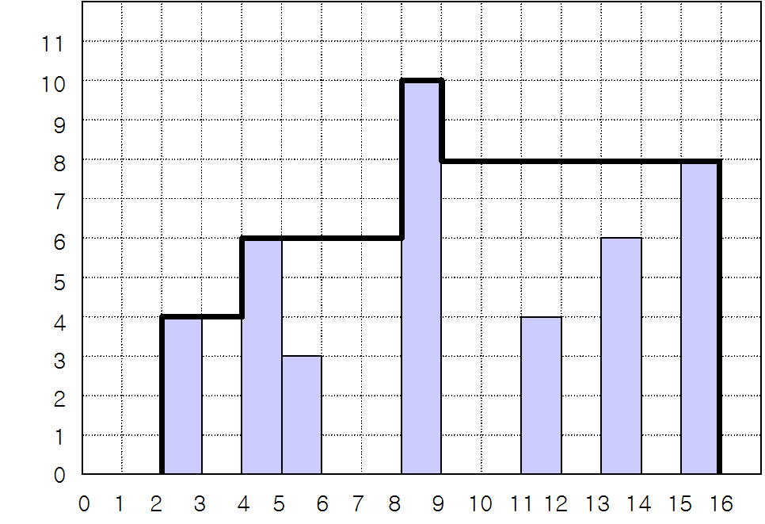

# [2304번: 창고 다각형](https://www.acmicpc.net/problem/2304)

N 개의 막대 기둥이 일렬로 세워져 있다. 기둥들의 폭은 모두 1 m이며 높이는 다를 수 있다. 이 기둥들을 이용하여 양철로 된 창고를 제작하려고 한다. 창고에는 모든 기둥이 들어간다. 이 창고의 지붕을 다음과 같이
만든다.

지붕은 수평 부분과 수직 부분으로 구성되며, 모두 연결되어야 한다.
지붕의 수평 부분은 반드시 어떤 기둥의 윗면과 닿아야 한다.
지붕의 수직 부분은 반드시 어떤 기둥의 옆면과 닿아야 한다.
지붕의 가장자리는 땅에 닿아야 한다.
비가 올 때 물이 고이지 않도록 지붕의 어떤 부분도 오목하게 들어간 부분이 없어야 한다.
그림 1은 창고를 옆에서 본 모습을 그린 것이다. 이 그림에서 굵은 선으로 표시된 부분이 지붕에 해당되고, 지붕과 땅으로 둘러싸인 다각형이 창고를 옆에서 본 모습이다. 이 다각형을 창고 다각형이라고 하자.



그림1 . 기둥과 지붕(굵은 선)의 예

창고 주인은 창고 다각형의 면적이 가장 작은 창고를 만들기를 원한다. 그림 1에서 창고 다각형의 면적은 98 ㎡이고, 이 경우가 가장 작은 창고 다각형이다.

기둥들의 위치와 높이가 주어질 때, 가장 작은 창고 다각형의 면적을 구하는 프로그램을 작성하시오.

## 입출력

### 입력
첫 줄에는 기둥의 개수를 나타내는 정수 N이 주어진다. 
N은 1 이상 1,000 이하이다. 
그 다음 N 개의 줄에는 각 줄에 각 기둥의 왼쪽 면의 위치를 나타내는 정수 L과 높이를 나타내는 정수 H가 한 개의 빈 칸을 사이에 두고 주어진다. 
L과 H는 둘 다 1 이상 1,000 이하이다.
### 출력
첫 줄에 창고 다각형의 면적을 나타내는 정수를 출력한다.

## 예제

### 예제 입력 1

```text
7
2 4
11 4
15 8
4 6
5 3
8 10
13 6
```

### 예제 출력 1

```text
98
```

## 알고리즘 분류

- 구현
- 자료 구조
- 브루트포스 알고리즘
- 스택

## 시도

### 시도1(32412kb, 32ms)

주어진 조건에서 기둥들을 기준으로 선을 그리고, 그려진 도형의 넓이를 구하는 문제이다.

처음에 코드를 구현할 때, `0 ~ 1000`까지 반복해서 0이 아닌 기둥의 위치를 저장하고, 저장된 인덱스의 값보다 큰 기둥을 만나면 거리와 높이를 계산해서 값을 누적하는 문제이다.

하지만, `max`값 이후에 어떻게 높은 값을 설정을 해야 하는지가 어려웠다. (핑계: 다른 일정들도 있어서 일단 빠르게 끝내고 싶었음)

결국 [승민아](https://non-stop.tistory.com/36)님의 블로그를 참고했고, 뒤에서부터 최대높이가 있는 인덱스까지 큰 값을 저장하며 접근하는 코드를 봤고,

코드를 참고하여 문제를 해결했다.

```python
# https://www.acmicpc.net/problem/2304
# 창고 다각형
import sys

input = sys.stdin.readline

N = int(input())
graphs = [0 for _ in range(1001)]
max_height = 0
max_height_pos = -1

for _ in range(N):
    l, h = map(int, input().split())
    if h > max_height:
        max_height = h
        max_height_pos = l
    graphs[l] = h

left = 0
answer = max_height
for now in range(max_height_pos):
    left = max(graphs[now], left)
    answer += left

right = 0
for now in range(1000, max_height_pos, -1):
    right = max(graphs[now], right)
    answer += right

print(answer)
```
