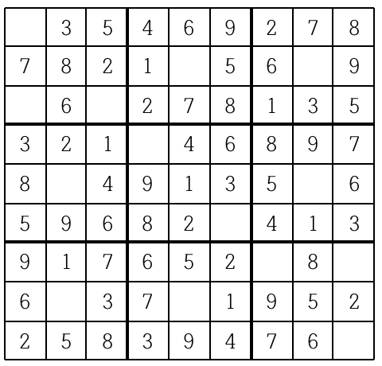
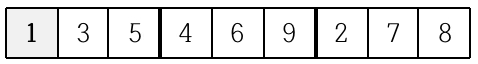
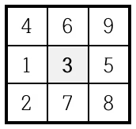
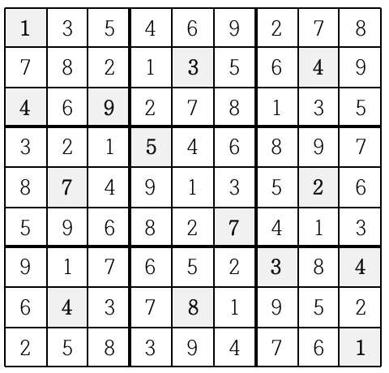

# [2580번: 스도쿠](https://www.acmicpc.net/problem/2580)

스도쿠는 18세기 스위스 수학자가 만든 '라틴 사각형'이랑 퍼즐에서 유래한 것으로 현재 많은 인기를 누리고 있다. 이 게임은 아래 그림과 같이 가로, 세로 각각 9개씩 총 81개의 작은 칸으로 이루어진 정사각형 판
위에서 이뤄지는데, 게임 시작 전 일부 칸에는 1부터 9까지의 숫자 중 하나가 쓰여 있다.



나머지 빈 칸을 채우는 방식은 다음과 같다.

각각의 가로줄과 세로줄에는 1부터 9까지의 숫자가 한 번씩만 나타나야 한다.
굵은 선으로 구분되어 있는 3x3 정사각형 안에도 1부터 9까지의 숫자가 한 번씩만 나타나야 한다.
위의 예의 경우, 첫째 줄에는 1을 제외한 나머지 2부터 9까지의 숫자들이 이미 나타나 있으므로 첫째 줄 빈칸에는 1이 들어가야 한다.



또한 위쪽 가운데 위치한 3x3 정사각형의 경우에는 3을 제외한 나머지 숫자들이 이미 쓰여있으므로 가운데 빈 칸에는 3이 들어가야 한다.



이와 같이 빈 칸을 차례로 채워 가면 다음과 같은 최종 결과를 얻을 수 있다.



게임 시작 전 스도쿠 판에 쓰여 있는 숫자들의 정보가 주어질 때 모든 빈 칸이 채워진 최종 모습을 출력하는 프로그램을 작성하시오.

## 입출력

### 입력

아홉 줄에 걸쳐 한 줄에 9개씩 게임 시작 전 스도쿠판 각 줄에 쓰여 있는 숫자가 한 칸씩 띄워서 차례로 주어진다. 스도쿠 판의 빈 칸의 경우에는 0이 주어진다. 스도쿠 판을 규칙대로 채울 수 없는 경우의 입력은
주어지지 않는다.

### 출력

모든 빈 칸이 채워진 스도쿠 판의 최종 모습을 아홉 줄에 걸쳐 한 줄에 9개씩 한 칸씩 띄워서 출력한다.

스도쿠 판을 채우는 방법이 여럿인 경우는 그 중 하나만을 출력한다.

## 예제

### 예제 입력 1

```text
0 3 5 4 6 9 2 7 8
7 8 2 1 0 5 6 0 9
0 6 0 2 7 8 1 3 5
3 2 1 0 4 6 8 9 7
8 0 4 9 1 3 5 0 6
5 9 6 8 2 0 4 1 3
9 1 7 6 5 2 0 8 0
6 0 3 7 0 1 9 5 2
2 5 8 3 9 4 7 6 0
```

### 예제 출력 1

```text
1 3 5 4 6 9 2 7 8
7 8 2 1 3 5 6 4 9
4 6 9 2 7 8 1 3 5
3 2 1 5 4 6 8 9 7
8 7 4 9 1 3 5 2 6
5 9 6 8 2 7 4 1 3
9 1 7 6 5 2 3 8 4
6 4 3 7 8 1 9 5 2
2 5 8 3 9 4 7 6 1
```

## 알고리즘 분류

- 구현
- 백트래킹

## 시도

### 시도1(시간초과)

알고리즘을 이용하여 스도쿠를 맞추는 문제이다.

이 문제를 푸는 데 고민할 부분은

1. 어떻게 숫자들을 하나씩 대입할 것인가
2. 어떻게 올바른 스도쿠인지 판별할 것인가

인 것 같다.

그 중 2번은 스도쿠 안의 값들을 직접 검사하면 되고,
1번에 대해 어떤 알고리즘으로 접근할 것인지를 생각해야 하는 문제인 것 같다.

숫자들을 하나씩 대입하는 건 백트래킹이 적합하다고 생각돼서 전체 범위에 대해
리스트를 돌면서, 0을 발견할 때 마다 새로운 back tracking으로 여러 숫자를 대입해봤다.

결과는 시간초과

```python
# https://www.acmicpc.net/problem/2580
# 스도쿠
import sys

input = sys.stdin.readline

SUDOKU_BOARD_TOTAL_SIZE = 9
SUDOKU_BOARD_SIZE = 3


def is_valid_board(boards, current):
    x, y = current
    row_visited = [False] * (SUDOKU_BOARD_TOTAL_SIZE + 1)
    col_visited = [False] * (SUDOKU_BOARD_TOTAL_SIZE + 1)
    for index in range(SUDOKU_BOARD_TOTAL_SIZE):
        r = boards[x][index]
        c = boards[index][y]
        if (r != 0 and row_visited[r]) or c != 0 and col_visited[c]:
            return False
        row_visited[r] = True
        col_visited[c] = True

    row_size = 3 * (x // SUDOKU_BOARD_SIZE)
    col_size = 3 * (y // SUDOKU_BOARD_SIZE)
    visited = [False] * (SUDOKU_BOARD_TOTAL_SIZE + 1)
    for row in range(row_size, row_size + SUDOKU_BOARD_SIZE):
        for col in range(col_size, col_size + SUDOKU_BOARD_SIZE):
            if boards[row][col] != 0 and visited[boards[row][col]]:
                return False
            visited[boards[row][col]] = True

    return True


def back_tracking(boards, current, length):
    if not is_valid_board(boards, current):
        return

    if length == 0:
        for board in boards:
            print(*board)
        exit()

    for i in range(SUDOKU_BOARD_TOTAL_SIZE):
        for j in range(SUDOKU_BOARD_TOTAL_SIZE):
            if boards[i][j] == 0:
                for k in range(1, SUDOKU_BOARD_TOTAL_SIZE + 1):
                    boards[i][j] = k
                    back_tracking(boards, (i, j), length - 1)
                    boards[i][j] = 0


graphs = []
size = 0
for _ in range(SUDOKU_BOARD_TOTAL_SIZE):
    line = list(map(int, input().split()))
    graphs.append(line)
    for num in line:
        if num == 0:
            size += 1

back_tracking(graphs, (0, 0), size)
```

### 시도2(132904kb, 2360ms)

[ChaeYami](https://chaeyami.tistory.com/224)님 블로그를 보고 작성한 코드이다.

기존의 모든 경우를 순회하는 것 대신, 0이 있는 위치를 기억한 후 인덱스를 1개씩 증가시키며, 올바른 보드인지 확인하고 값을 삽입한다.

시간 초과가 발생해서 이유가 뭔지 몰라서 계속 고민했는데,, pypy로 제출하니 정답이 인정됐다.

```python
# https://www.acmicpc.net/problem/2580
# 스도쿠
import sys

input = sys.stdin.readline

SUDOKU_BOARD_TOTAL_SIZE = 9
SUDOKU_BOARD_SIZE = 3


def is_valid_board(boards, current, n):
    x, y = current

    for index in range(SUDOKU_BOARD_TOTAL_SIZE):
        if boards[x][index] == n:
            return False
        if boards[index][y] == n:
            return False

    row_size = 3 * (x // SUDOKU_BOARD_SIZE)
    col_size = 3 * (y // SUDOKU_BOARD_SIZE)

    for row in range(row_size, row_size + SUDOKU_BOARD_SIZE):
        for col in range(col_size, col_size + SUDOKU_BOARD_SIZE):
            if boards[row][col] == n:
                return False
    return True


def back_tracking(boards, now, empty_list):
    if now == len(empty_list):
        for board in boards:
            print(*board)
        exit()

    for number in range(1, SUDOKU_BOARD_TOTAL_SIZE + 1):
        r, c = empty_list[now]
        if is_valid_board(boards, (r, c), number):
            boards[r][c] = number
            back_tracking(boards, now + 1, empty_list)
            boards[r][c] = 0

    return


graphs = []
empty = []
for i in range(SUDOKU_BOARD_TOTAL_SIZE):
    line = list(map(int, input().split()))
    graphs.append(line)
    for j in range(len(line)):
        if line[j] == 0:
            empty.append((i, j))

back_tracking(graphs, 0, empty)
```

## 정리

코드를 작성한 후 조금 더 최적화할 수 있는 방법을 고민해봐야겠다.
