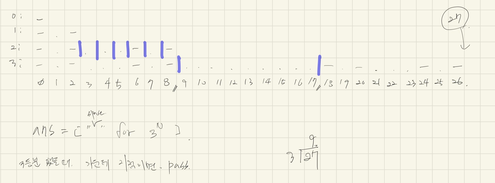
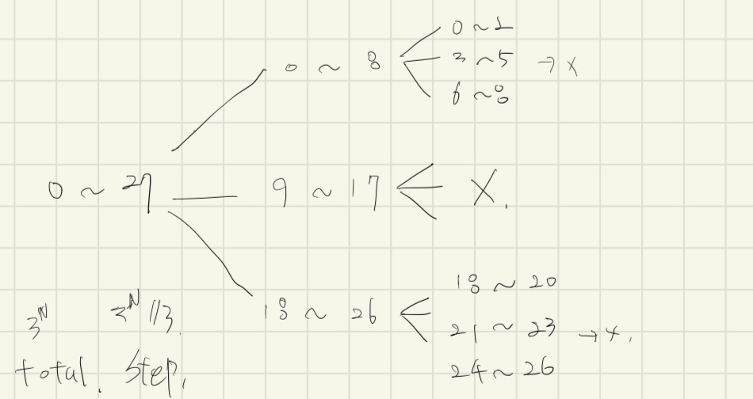

# [4779번: 칸토어 집합](https://www.acmicpc.net/problem/4779)

칸토어 집합은 0과 1사이의 실수로 이루어진 집합으로, 구간 [0, 1]에서 시작해서 각 구간을 3등분하여 가운데 구간을 반복적으로 제외하는 방식으로 만든다.

전체 집합이 유한이라고 가정하고, 다음과 같은 과정을 통해서 칸토어 집합의 근사를 만들어보자.

1. -가 3N개 있는 문자열에서 시작한다.

2. 문자열을 3등분 한 뒤, 가운데 문자열을 공백으로 바꾼다. 이렇게 하면, 선(문자열) 2개가 남는다.

3. 이제 각 선(문자열)을 3등분 하고, 가운데 문자열을 공백으로 바꾼다. 이 과정은 모든 선의 길이가 1일때 까지 계속 한다.

예를 들어, N=3인 경우, 길이가 27인 문자열로 시작한다.

```text
---------------------------
```

여기서 가운데 문자열을 공백으로 바꾼다.

```text
---------         ---------
```

남은 두 선의 가운데 문자열을 공백으로 바꾼다.

```text
---   ---         ---   ---
```

한번 더

```text
- -   - -         - -   - -
```

모든 선의 길이가 1이면 멈춘다.
N이 주어졌을 때, 마지막 과정이 끝난 후 결과를 출력하는 프로그램을 작성하시오.

## 입출력

### 입력

입력을 여러 줄로 이루어져 있다. 각 줄에 N이 주어진다.
파일의 끝에서 입력을 멈춘다.
N은 0보다 크거나 같고, 12보다 작거나 같은 정수이다.

### 출력

입력으로 주어진 N에 대해서, 해당하는 칸토어 집합의 근사를 출력한다.

## 예제

### 예제 입력 1

```text
0
1
3
2
```

### 예제 출력 1

```text
-
- -
- -   - -         - -   - -
- -   - -
```

## 알고리즘 분류

- 분할 정복
- 재귀

## 시도

### 시도1(49444kb, 376ms)

`ㅡ` 를 N번 3등분하여 정해진 규칙대로 출력하는 문제이다.

재귀에 익숙하지 않아 직접 그리고, 인덱스를 직접 그리면서 3등분 해보았다.



처음에는 반복문을 이용해서 문제를 해결해볼까 하다가 그래도 재귀 문제이니까 재귀 함수를 이용해서 문제를 해결하고 싶었다.(재귀 코드가 더 간결할 것 같기도 했음)

계속해서 고민하던 중 아래 그림처럼 전체 크기를 3등분하고 가운데는 방문하지 않으면 된다는 걸 알게 되었다.



해당 아이디어를 알고리즘으로 구현한 코드

```python
import sys

input = sys.stdin.readline


def divide(arr, start, end):
    if end - start > 3:
        third = (end - start) // 3
        divide(arr, start, start + third)
        divide(arr, end - third, end)
    else:
        for current in range(start, end):
            if current % 2 == 0:
                arr[current] = "-"

    return arr


while True:
    line = input().rstrip()

    if line == "":
        break

    count = int(line)
    answer = [" " for _ in range(3 ** count)]
    print(*divide(answer, 0, 3 ** count), sep='')
# """
# -
# - -
# - -   - -
# - -   - -         - -   - -
# - -   - -         - -   - -                           - -   - -         - -   - -
# """
```

### 시도2(32412kb, 504ms)

[릿99](https://beginnerdeveloper-lit.tistory.com/141)님의 블로그를 보고 작성한 코드이다.

**릿99**님은 `start ~ end`로 구분하지 않고, n으로만 구분해서 코드를 작성했다.

코드가 간결하고 재밌어서 다시 작성해봤다.

```python
# https://www.acmicpc.net/problem/4779
# 칸토어 집합
import sys

input = sys.stdin.readline


def cantor(n):
    size = 3 ** (n - 1)

    if n == 0:
        print("-", end='')
        return

    cantor(n - 1)
    for _ in range(size):
        print(" ", end='')
    cantor(n - 1)


while True:
    line = input().rstrip()

    if line == "":
        break

    cantor(int(line))
    print()

```

### 시도3

```python

```

### 시도4

```python

```

## 정리 및 소감
